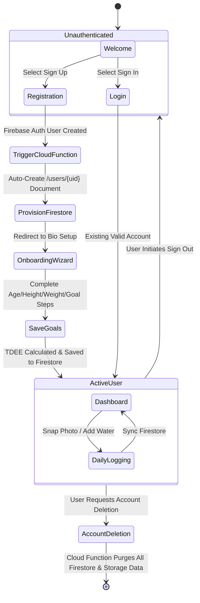
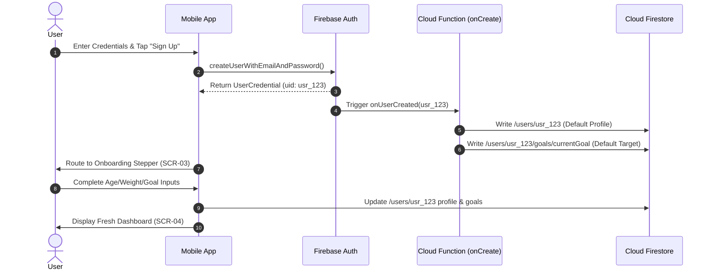

# FitFuel — Authentication & Data Architecture Specification
**Production-Ready Backend, Authentication Strategy, Firestore Schemas & Security Rules**

---

| System Version | Lead Backend Engineer | Platform Ecosystem | Database System | Auth Mechanism |
| :--- | :--- | :--- | :--- | :--- |
| **1.0.0-BACKEND** | Senior Firebase & Cloud Architect | Firebase / GCP Serverless | Cloud Firestore & Firebase Storage | Firebase Auth (OAuth 2.0 / JWT) |

---

## Executive Summary

This document defines the complete, production-grade **Authentication Strategy, User Lifecycle Engine, Cloud Firestore Data Architecture, and Security Model** for **FitFuel**. 

Grounded in the approved `SOFTWARE_PLANNING_DOCUMENT.md`, `FITFUEL_UI_UX_DESIGN_SPECIFICATION.md`, and `FITFUEL_DESIGN_SYSTEM.md`, this architecture enforces strict **User-Centric Data Isolation**. Every data record is bound to an authenticated Firebase User ID (`uid`). Newly registered users automatically start with a completely fresh, isolated data partition, while existing users retrieve only their own data with zero risk of cross-tenant leakage.

---

## Table of Contents
1. [Authentication Strategy](#1-authentication-strategy)
2. [User Lifecycle Architecture](#2-user-lifecycle-architecture)
3. [Firestore Data Model & Schemas](#3-firestore-data-model--schemas)
4. [UID Association & Multi-Tenant Data Isolation](#4-uid-association--multi-tenant-data-isolation)
5. [Fresh Data Provisioning vs. Data Retrieval Engine](#5-fresh-data-provisioning-vs-data-retrieval-engine)
6. [Production Firestore Security Rules](#6-production-firestore-security-rules)
7. [Authentication & Lifecycle Flow Diagrams](#7-authentication--lifecycle-flow-diagrams)
8. [Architectural Best Practices (Scalability, Security & Offline)](#8-architectural-best-practices-scalability-security--offline)

---

## 1. Authentication Strategy

FitFuel utilizes **Firebase Authentication** as its primary identity provider, delivering secure, stateless OAuth 2.0 / JWT-based access control across mobile clients.

```
                    FITFUEL AUTHENTICATION ENGINE
┌───────────────────────────────────────────────────────────────────┐
│                      Firebase Authentication                      │
├─────────────────────────────────┬─────────────────────────────────┤
│ Email / Password Auth           │ Social OAuth (Google Sign-In)   │
│ - Mandatory Email Verification  │ - Single-Tap OAuth Token Swap   │
│ - Password Reset Email Trigger  │ - Automatic Profile Import      │
└─────────────────────────────────┴─────────────────────────────────┘
                                  │
                                  ▼
                   Stateless JWT (Firebase ID Token)
                   Enforced at Firestore & Cloud Functions
```

### 1.1 Auth Provider Specifications

#### 1. Email / Password Authentication
* **Password Policy:** Minimum 8 characters, requiring at least one uppercase letter, one number, and one special character (`!@#$%^&*`).
* **Email Verification:** Upon initial sign-up via email/password, a verification link is triggered via Firebase Auth. The client displays a unverified banner until `user.emailVerified == true`.
* **Password Reset Flow:** Triggers standard Firebase `sendPasswordResetEmail(email)`. Outgoing emails use custom branded HTML templates matching FitFuel Emerald branding.

#### 2. Google Sign-In (OAuth 2.0)
* **Mobile Integration:** Utilizes native Google Identity Services on Android and Google Sign-In SDK on iOS.
* **Token Handshake:** Mobile client receives Google ID Token and exchanges it for a Firebase Auth Credential via `GoogleAuthProvider.credential(idToken, accessToken)`.
* **Zero Verification Step:** Users authenticating via Google are automatically flagged as verified (`emailVerified = true`).

#### 3. Session Management & Token Rotation
* **ID Tokens (Short-Lived):** 1-hour expiration JWT tokens issued by Firebase Auth. Sent in the HTTP `Authorization: Bearer <ID_TOKEN>` header for Cloud Functions.
* **Refresh Tokens (Long-Lived):** Stored securely on-device in **Encrypted SharedPreferences (Android)** and **Keychain (iOS)**. Automatically rotated by the Firebase Client SDK.
* **Logout Strategy:** Triggers `FirebaseAuth.signOut()`. Client clears local offline Firestore caches, resets BLoC state trees, and navigates back to the Welcome Screen (`SCR-02a`).

---

## 2. User Lifecycle Architecture

The user lifecycle governs account provisioning, onboarding initialization, session persistence, and GDPR-compliant account destruction.



### 2.1 Lifecycle Stage Specs

1. **Stage 1: New User Registration & Auto-Provisioning**
   * Client creates auth user via `createUserWithEmailAndPassword` or `signInWithCredential`.
   * A Firebase **Cloud Function Event Trigger (`onCreate`)** automatically executes server-side, creating a fresh user root document at `/users/{userId}` populated with default metadata and an empty daily log skeleton.

2. **Stage 2: First-Time Onboarding Stepper**
   * The client detects `profile.isOnboardingComplete == false` and routes the user directly to `SCR-03` (Onboarding Stepper).
   * User inputs age, height, weight, activity level, and primary goal. The client computes BMR/TDEE via the Mifflin-St Jeor formula and updates `/users/{userId}` profile and `/users/{userId}/goals/currentGoal`.

3. **Stage 3: Returning User Login**
   * The client verifies token validity upon launch. If valid, fetches `/users/{userId}` and `/users/{userId}/dailyLogs/{currentDate}`. If no daily log document exists for today's date, it creates a fresh daily summary shell.

4. **Stage 4: Account Deletion (GDPR Article 17 Compliance)**
   * When a user selects "Delete Account" in Settings (`SCR-12b`), a call is made to HTTPS Callable Cloud Function `deleteUserAccount`.
   * The Cloud Function recursively purges:
     1. All documents in `/users/{userId}/` and its subcollections (`dailyLogs`, `meals`, `waterLogs`, `weightLogs`, `goals`, `notifications`, `settings`, `premium`).
     2. All scan images stored in Firebase Storage bucket under `/users/{userId}/scans/`.
     3. The Firebase Auth user record via Firebase Admin SDK `auth().deleteUser(uid)`.

---

## 3. Firestore Data Model & Schemas

Cloud Firestore is structured around a **User-Centric Document Model**. Every user collection is nested beneath `/users/{userId}`, ensuring native authorization enforcement, optimized query routing, and zero data leakage.

```
firestore-root
├── users (Collection)
│   └── {userId} (Document - Core User Profile)
│       ├── goals (Subcollection)
│       │   └── currentGoal (Document - TDEE & Macro Targets)
│       ├── daily_summary (Subcollection)
│       │   └── {YYYY-MM-DD} (Document - Aggregated Daily Metrics)
│       │       ├── meals (Subcollection)
│       │       │   └── {mealId} (Document - Individual Meal Scans)
│       │       └── water_logs (Subcollection)
│       │           └── {waterLogId} (Document - Hydration Entries)
│       ├── weight_logs (Subcollection)
│       │   └── {logId} (Document - Body Weight Entries)
│       ├── ai_analysis (Subcollection)
│       │   └── {analysisId} (Document - Raw Gemini Response Audit Logs)
│       ├── notifications (Subcollection)
│       │   └── {notificationId} (Document - User Alerts)
│       ├── settings (Subcollection)
│       │   └── userSettings (Document - Preferences)
│       └── premium (Subcollection)
│           └── subscriptionStatus (Document - RevenueCat Sync)
```

---

### 3.1 Detailed Collection Schemas

#### 1. Core Profile Document: `users/{userId}`
```json
{
  "uid": "usr_98f7a6b5c4",
  "email": "alex.turner@example.com",
  "displayName": "Alex Turner",
  "photoUrl": "https://lh3.googleusercontent.com/a/default-user",
  "createdAt": "2026-08-01T10:00:00Z",
  "lastLoginAt": "2026-08-07T18:00:00Z",
  "emailVerified": true,
  "profile": {
    "gender": "male",
    "age": 32,
    "heightCm": 180,
    "currentWeightKg": 82.5,
    "targetWeightKg": 78.0,
    "activityLevel": "moderately_active",
    "primaryGoal": "lose_weight",
    "unitSystem": "metric",
    "isOnboardingComplete": true
  }
}
```

#### 2. Goals Subcollection: `users/{userId}/goals/currentGoal`
```json
{
  "userId": "usr_98f7a6b5c4",
  "bmr": 1825,
  "tdee": 2510,
  "dailyCalorieTarget": 2010,
  "macroTargets": {
    "proteinGrams": 150,
    "carbsGrams": 200,
    "fatGrams": 67
  },
  "waterTargetMl": 3000,
  "updatedAt": "2026-08-01T10:15:00Z"
}
```

#### 3. Daily Summary Subcollection: `users/{userId}/daily_summary/{YYYY-MM-DD}`
```json
{
  "date": "2026-08-07",
  "userId": "usr_98f7a6b5c4",
  "totalCaloriesConsumed": 1850,
  "totalProteinGrams": 142.5,
  "totalCarbsGrams": 180.0,
  "totalFatGrams": 61.0,
  "totalWaterMl": 2500,
  "targetCalories": 2010,
  "isTargetMet": true,
  "mealCount": 3,
  "lastUpdated": "2026-08-07T14:30:00Z"
}
```

#### 4. Meals Subcollection: `users/{userId}/daily_summary/{YYYY-MM-DD}/meals/{mealId}`
```json
{
  "mealId": "meal_88a91c",
  "userId": "usr_98f7a6b5c4",
  "date": "2026-08-07",
  "mealType": "lunch",
  "loggedAt": "2026-08-07T13:15:00Z",
  "source": "gemini_vision",
  "imageUrl": "https://firebasestorage.googleapis.com/v0/b/fitfuel.appspot.com/o/users%2Fusr_98f7a6b5c4%2Fscans%2F2026-08%2Fscan_12345.jpg",
  "confidenceScore": 0.94,
  "summary": {
    "totalCalories": 650,
    "proteinGrams": 45.0,
    "carbsGrams": 55.0,
    "fatGrams": 22.0
  },
  "items": [
    {
      "itemId": "item_1",
      "name": "Grilled Salmon Fillet",
      "servingWeightGrams": 200,
      "calories": 410,
      "proteinGrams": 40.0,
      "carbsGrams": 0.0,
      "fatGrams": 25.0
    },
    {
      "itemId": "item_2",
      "name": "Steamed Quinoa",
      "servingWeightGrams": 150,
      "calories": 240,
      "proteinGrams": 5.0,
      "carbsGrams": 55.0,
      "fatGrams": 2.0
    }
  ]
}
```

#### 5. Water Logs Subcollection: `users/{userId}/daily_summary/{YYYY-MM-DD}/water_logs/{waterLogId}`
```json
{
  "waterLogId": "wat_12a34b",
  "userId": "usr_98f7a6b5c4",
  "date": "2026-08-07",
  "amountMl": 250,
  "loggedAt": "2026-08-07T10:30:00Z"
}
```

#### 6. Weight Logs Subcollection: `users/{userId}/weight_logs/{logId}`
```json
{
  "logId": "wgt_99c88v",
  "userId": "usr_98f7a6b5c4",
  "weightKg": 82.5,
  "note": "Morning measurement before breakfast",
  "loggedAt": "2026-08-07T07:15:00Z"
}
```

#### 7. AI Analysis Audit Subcollection: `users/{userId}/ai_analysis/{analysisId}`
```json
{
  "analysisId": "ai_scan_777b",
  "userId": "usr_98f7a6b5c4",
  "timestamp": "2026-08-07T13:14:58Z",
  "rawGeminiPrompt": "Analyze provided meal image...",
  "rawJsonResponse": "{\"detectedItems\": [...]}",
  "latencyMs": 1420,
  "userEditsMade": true
}
```

#### 8. Notifications Subcollection: `users/{userId}/notifications/{notificationId}`
```json
{
  "notificationId": "notif_44a",
  "userId": "usr_98f7a6b5c4",
  "title": "High Sodium Indicator",
  "body": "Your lunch provided 65% of your daily recommended sodium limit.",
  "type": "warning",
  "isRead": false,
  "createdAt": "2026-08-07T13:20:00Z"
}
```

#### 9. User Settings Subcollection: `users/{userId}/settings/userSettings`
```json
{
  "userId": "usr_98f7a6b5c4",
  "themeMode": "dark",
  "unitSystem": "metric",
  "notificationsEnabled": true,
  "mealReminders": true,
  "waterReminders": true,
  "updatedAt": "2026-08-01T10:15:00Z"
}
```

#### 10. Premium Subscription Subcollection: `users/{userId}/premium/subscriptionStatus`
```json
{
  "userId": "usr_98f7a6b5c4",
  "isProMember": true,
  "tier": "annual_pro",
  "scansRemainingToday": 9999,
  "expirationDate": "2027-08-01T10:00:00Z",
  "revenueCatEntitlementId": "fitfuel_pro",
  "lastSyncedAt": "2026-08-07T12:00:00Z"
}
```

---

## 4. UID Association & Multi-Tenant Data Isolation

To prevent cross-user data leakage, FitFuel enforces **Strict UID Anchoring**:

1. **Path-Based Isolation:** All document paths incorporate `{userId}` as the root collection document parameter (`/users/{userId}/...`).
2. **Field-Level UID Association:** Every document schema contains an explicit `userId: "usr_xxx"` attribute matching the owner's Firebase Auth `request.auth.uid`.
3. **Firestore Security Enforcement:** The database security engine evaluates every `read`, `create`, `update`, and `delete` operation against `request.auth.uid == userId`. Any cross-user query attempts fail instantly at the database engine level with a `PERMISSION_DENIED` exception.

---

## 5. Fresh Data Provisioning vs. Data Retrieval Engine

### 5.1 Fresh Data Provisioning (Newly Registered User)
When a user registers for the first time (`uid: "usr_NEW_123"`):
1. **Zero Legacy Data:** Because Firestore collections are keyed strictly by `{userId}`, `usr_NEW_123` points to a non-existent document path (`/users/usr_NEW_123`).
2. **Automated Provisioning:** The server-side Cloud Function `onUserCreated` provisions a clean document structure containing default initial goals (`waterTargetMl: 2500`, empty daily logs array).
3. **Clean Slate Dashboard:** The mobile UI fetches `/users/usr_NEW_123/daily_summary/2026-08-07`, receives `null`, and renders the **Empty State Dashboard** ("No meals logged today. Tap camera to scan!").

### 5.2 Existing User Data Retrieval Engine
When an existing user logs in (`uid: "usr_EXISTING_456"`):
1. **Targeted Document Fetch:** The mobile app queries `/users/usr_EXISTING_456/daily_summary/2026-08-07` and `/users/usr_EXISTING_456/goals/currentGoal`.
2. **Security Rules Validation:** Firestore validates `request.auth.uid ("usr_EXISTING_456") == path.userId ("usr_EXISTING_456")`. Authorization succeeds.
3. **Reactive UI Rendering:** The client streams real-time snapshot listeners (`snapshots()`), instantly updating the dashboard progress rings, water bar, and meal timeline with the user's historical data.

---

## 6. Production Firestore Security Rules

Deploy this `firestore.rules` configuration to enforce absolute data isolation, read/write authorization, and schema validation:

```javascript
rules_version = '2';
service cloud.firestore {
  match /databases/{database}/documents {

    // Helper Functions
    function isAuthenticated() {
      return request.auth != null;
    }

    function isOwner(userId) {
      return isAuthenticated() && request.auth.uid == userId;
    }

    function isValidUserDocument(userId) {
      return request.resource.data.uid == userId;
    }

    // Root Users Collection: Strictly accessible only by the authenticated owner
    match /users/{userId} {
      allow read, write: if isOwner(userId);

      // Goals Subcollection
      match /goals/{goalId} {
        allow read, write: if isOwner(userId);
      }

      // Daily Summary Subcollection & Child Meals / Water Logs
      match /daily_summary/{date} {
        allow read, write: if isOwner(userId);

        match /meals/{mealId} {
          allow read, write: if isOwner(userId);
        }

        match /water_logs/{waterLogId} {
          allow read, write: if isOwner(userId);
        }
      }

      // Weight Logs Subcollection
      match /weight_logs/{logId} {
        allow read, write: if isOwner(userId);
      }

      // AI Analysis Audit Logs Subcollection
      match /ai_analysis/{analysisId} {
        allow read: if isOwner(userId);
        allow write: if isOwner(userId); // Written by Cloud Function / Authenticated App
      }

      // Notifications Subcollection
      match /notifications/{notificationId} {
        allow read, write: if isOwner(userId);
      }

      // User Settings Subcollection
      match /settings/{settingId} {
        allow read, write: if isOwner(userId);
      }

      // Premium Subscription Status Subcollection (Read-only for client; Write via Admin SDK / RevenueCat webhook)
      match /premium/{premiumId} {
        allow read: if isOwner(userId);
        allow write: if false; // Server-side update only
      }
    }

    // Default Fallback: Block all unauthorized access to any unspecified paths
    match /{document=**} {
      allow read, write: if false;
    }
  }
}
```

---

## 7. Authentication & Lifecycle Flow Diagrams

### 7.1 New User Registration & Auto-Provisioning Flow



---

## 8. Architectural Best Practices

### 8.1 Offline Persistence & Caching
* **Firestore Offline Cache:** Enabled natively on Flutter (`FirebaseFirestore.instance.settings = Settings(persistenceEnabled: true)`).
* **Optimistic Local UI Updates:** Meal additions and water logs are written instantly to the local offline cache. Dashboard progress rings update in under 50ms while background queue synchronization handles network persistence.

### 8.2 Scalability & Performance Benchmarks
* **Sub-100ms Query Times:** Subcollection structuring (`/users/{userId}/daily_summary/{date}`) eliminates multi-tenant query scans. Fetching a single day's meal log executes a direct document lookup (`O(1)` time complexity).
* **Composite Indexes:** Key indexes defined for historical analytics:
  * Collection: `weight_logs`, Fields: `userId ASC, loggedAt DESC`
  * Collection: `meals`, Fields: `userId ASC, loggedAt DESC`

### 8.3 Security & Threat Mitigation
* **App Check Enforcement:** Firebase App Check with **Play Integrity (Android)** and **DeviceCheck (iOS)** prevents unauthorized curl scripts or non-app clients from hitting Firestore APIs.
* **Zero Client Secrets:** All third-party secrets (Gemini API keys, RevenueCat webhook keys) are managed in GCP Secret Manager and accessed exclusively by Cloud Functions.

---
*End of Authentication & Data Architecture Specification.*
