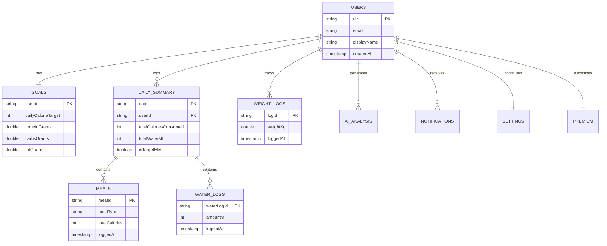

# FitFuel — Master Firestore Database Design & Data Architecture
**Production-Ready Database Blueprint, Schemas, Indexing & Optimization Strategy**

---

| Document Version | Lead Architect | Database Engine | Isolation Paradigm | Scale Target |
| :--- | :--- | :--- | :--- | :--- |
| **1.0.0-DB** | Senior Firebase Database Architect | Cloud Firestore (Serverless NoSQL) | Single-Tenant Path Partitioning (`/users/{uid}`) | 1,000,000+ MAU |

---

## Executive Summary

This document defines the complete, production-grade **Cloud Firestore Database Architecture** for **FitFuel**. Grounded in the approved `SOFTWARE_PLANNING_DOCUMENT.md`, `FITFUEL_UI_UX_DESIGN_SPECIFICATION.md`, `FITFUEL_DESIGN_SYSTEM.md`, and `AUTHENTICATION_AND_DATA_ARCHITECTURE.md`, this design guarantees **sub-100ms query performance**, **strict multi-tenant data isolation by Firebase UID**, **optimistic offline synchronization**, and **zero cost overruns** as the platform scales to millions of users.

---

## Table of Contents
1. [Firestore Database Architecture](#1-firestore-database-architecture)
2. [Collections & Subcollections Tree](#2-collections--subcollections-tree)
3. [Complete Document Schemas](#3-complete-document-schemas)
4. [Field Definitions & Data Types](#4-field-definitions--data-types)
5. [Required vs. Optional Fields Matrix](#5-required-vs-optional-fields-matrix)
6. [Entity Relationships & Data Normalization](#6-entity-relationships--data-normalization)
7. [Recommended Firestore Composite Indexes](#7-recommended-firestore-composite-indexes)
8. [Query Optimization Strategy](#8-query-optimization-strategy)
9. [Offline Synchronization & Caching Strategy](#9-offline-synchronization--caching-strategy)
10. [Pagination Strategy (Cursor-Based)](#10-pagination-strategy-cursor-based)
11. [Data Validation & Integrity Rules](#11-data-validation--integrity-rules)
12. [Data Lifecycle Management & TTL Rules](#12-data-lifecycle-management--ttl-rules)
13. [Soft Delete vs. Permanent Delete Policy](#13-soft-delete-vs-permanent-delete-policy)
14. [Backup, Point-in-Time Recovery & Disaster Recovery](#14-backup-point-in-time-recovery--disaster-recovery)
15. [Scalability & Hotspot Mitigation](#15-scalability--hotspot-mitigation)
16. [Security Considerations & Rules Binding](#16-security-considerations--rules-binding)
17. [Performance Benchmarks & Optimization Checklist](#17-performance-benchmarks--optimization-checklist)
18. [Naming Conventions & Code Standards](#18-naming-conventions--code-standards)
19. [Example Production JSON Documents](#19-example-production-json-documents)
20. [Entity-Relationship (ER) Diagram](#20-entity-relationship-er-diagram)

---

## 1. Firestore Database Architecture

FitFuel utilizes a **User-Centric Subcollection Tree Model**. Rather than storing all meals, water logs, and weight entries in massive global root collections, data is strictly partitioned beneath each user's unique Firebase Authentication ID (`/users/{userId}`).

```
                               FIRESTORE ROOT ARCHITECTURE
┌────────────────────────────────────────────────────────────────────────────────────────┐
│  /users/{userId}  (Root User Document - Profile & Account State)                       │
│     ├── /goals/currentGoal                   (TDEE, BMR, Macro Target Document)        │
│     ├── /daily_summary/{YYYY-MM-DD}          (Daily Aggregated Metrics)                │
│     │      ├── /meals/{mealId}               (Individual Logged Meals & Gemini Scans)  │
│     │      └── /water_logs/{waterLogId}      (Hydration Log Entries)                   │
│     ├── /weight_logs/{logId}                 (Historical Body Weight Logs)             │
│     ├── /ai_analysis/{analysisId}            (Gemini Vision Response Audit Log)        │
│     ├── /notifications/{notificationId}      (In-App Health & System Alerts)           │
│     ├── /settings/userSettings               (Preferences & Measurement Units)         │
│     └── /premium/subscriptionStatus          (RevenueCat Entitlements & Pro Status)    │
└────────────────────────────────────────────────────────────────────────────────────────┘
```

### Key Architectural Benefits:
1. **Implicit Data Isolation:** No user can query another user's documents because path traversal requires `request.auth.uid == userId`.
2. **Infinite Horizontal Scalability:** Operations scale per-user rather than hitting global collection write caps.
3. **Low-Latency Direct Lookups:** Fetching today's meal summary is an `O(1)` key-value lookup: `/users/{uid}/daily_summary/2026-08-07`.

---

## 2. Collections & Subcollections Tree

| Collection / Subcollection Path | Parent | Document ID Strategy | Purpose |
| :--- | :--- | :--- | :--- |
| `/users` | Root | Firebase Auth `uid` | User profile & core metrics |
| `/users/{uid}/goals` | User | `currentGoal` (Fixed ID) | BMR, TDEE, & macro splits |
| `/users/{uid}/daily_summary` | User | `YYYY-MM-DD` (ISO Date) | Daily aggregated totals & target status |
| `/users/{uid}/daily_summary/{date}/meals` | Daily Summary | `mealId` (Auto-ID `meal_xxx`) | Individual logged meals |
| `/users/{uid}/daily_summary/{date}/water_logs` | Daily Summary | `waterLogId` (Auto-ID `wat_xxx`)| Hydration intake entries |
| `/users/{uid}/weight_logs` | User | `logId` (Auto-ID `wgt_xxx`) | Weight trend tracking entries |
| `/users/{uid}/ai_analysis` | User | `analysisId` (Auto-ID `ai_xxx`) | Raw Gemini audit trail |
| `/users/{uid}/notifications` | User | `notificationId` (Auto-ID) | User notifications |
| `/users/{uid}/settings` | User | `userSettings` (Fixed ID) | Application settings |
| `/users/{uid}/premium` | User | `subscriptionStatus` (Fixed ID) | RevenueCat IAP subscription status |

---

## 3. Complete Document Schemas

### 3.1 Profile Document: `/users/{userId}`
```json
{
  "uid": "usr_98f7a6b5c4",
  "email": "alex.turner@example.com",
  "displayName": "Alex Turner",
  "photoUrl": "https://lh3.googleusercontent.com/a/default-user",
  "createdAt": "2026-08-01T10:00:00Z",
  "lastLoginAt": "2026-08-07T18:00:00Z",
  "emailVerified": true,
  "profile": {
    "gender": "male",
    "age": 32,
    "heightCm": 180,
    "currentWeightKg": 82.5,
    "targetWeightKg": 78.0,
    "activityLevel": "moderately_active",
    "primaryGoal": "lose_weight",
    "unitSystem": "metric",
    "isOnboardingComplete": true
  },
  "metadata": {
    "schemaVersion": "1.0",
    "platform": "ios",
    "appVersion": "1.0.0"
  }
}
```

### 3.2 Goals Document: `/users/{userId}/goals/currentGoal`
```json
{
  "userId": "usr_98f7a6b5c4",
  "bmr": 1825,
  "tdee": 2510,
  "dailyCalorieTarget": 2010,
  "macroTargets": {
    "proteinGrams": 150,
    "carbsGrams": 200,
    "fatGrams": 67
  },
  "waterTargetMl": 3000,
  "updatedAt": "2026-08-01T10:15:00Z"
}
```

### 3.3 Daily Summary Document: `/users/{userId}/daily_summary/{YYYY-MM-DD}`
```json
{
  "date": "2026-08-07",
  "userId": "usr_98f7a6b5c4",
  "totalCaloriesConsumed": 1850,
  "totalProteinGrams": 142.5,
  "totalCarbsGrams": 180.0,
  "totalFatGrams": 61.0,
  "totalWaterMl": 2500,
  "targetCalories": 2010,
  "isTargetMet": true,
  "mealCount": 3,
  "lastUpdated": "2026-08-07T14:30:00Z"
}
```

### 3.4 Meal Document: `/users/{userId}/daily_summary/{YYYY-MM-DD}/meals/{mealId}`
```json
{
  "mealId": "meal_88a91c",
  "userId": "usr_98f7a6b5c4",
  "date": "2026-08-07",
  "mealType": "lunch",
  "loggedAt": "2026-08-07T13:15:00Z",
  "source": "gemini_vision",
  "imageUrl": "https://firebasestorage.googleapis.com/v0/b/fitfuel.appspot.com/o/users%2Fusr_98f7a6b5c4%2Fscans%2F2026-08%2Fscan_12345.jpg",
  "confidenceScore": 0.94,
  "summary": {
    "totalCalories": 650,
    "proteinGrams": 45.0,
    "carbsGrams": 55.0,
    "fatGrams": 22.0
  },
  "items": [
    {
      "itemId": "item_1",
      "name": "Grilled Salmon Fillet",
      "servingWeightGrams": 200,
      "calories": 410,
      "proteinGrams": 40.0,
      "carbsGrams": 0.0,
      "fatGrams": 25.0
    },
    {
      "itemId": "item_2",
      "name": "Steamed Quinoa",
      "servingWeightGrams": 150,
      "calories": 240,
      "proteinGrams": 5.0,
      "carbsGrams": 55.0,
      "fatGrams": 2.0
    }
  ]
}
```

### 3.5 Water Log Document: `/users/{userId}/daily_summary/{YYYY-MM-DD}/water_logs/{waterLogId}`
```json
{
  "waterLogId": "wat_12a34b",
  "userId": "usr_98f7a6b5c4",
  "date": "2026-08-07",
  "amountMl": 250,
  "loggedAt": "2026-08-07T10:30:00Z"
}
```

### 3.6 Weight Log Document: `/users/{userId}/weight_logs/{logId}`
```json
{
  "logId": "wgt_99c88v",
  "userId": "usr_98f7a6b5c4",
  "weightKg": 82.5,
  "note": "Morning measurement before breakfast",
  "loggedAt": "2026-08-07T07:15:00Z"
}
```

### 3.7 AI Analysis Document: `/users/{userId}/ai_analysis/{analysisId}`
```json
{
  "analysisId": "ai_scan_777b",
  "userId": "usr_98f7a6b5c4",
  "timestamp": "2026-08-07T13:14:58Z",
  "rawGeminiPrompt": "Analyze provided meal image...",
  "rawJsonResponse": "{\"detectedItems\": [...]}",
  "latencyMs": 1420,
  "userEditsMade": true
}
```

### 3.8 Notification Document: `/users/{userId}/notifications/{notificationId}`
```json
{
  "notificationId": "notif_44a",
  "userId": "usr_98f7a6b5c4",
  "title": "High Sodium Indicator",
  "body": "Your lunch provided 65% of your daily recommended sodium limit.",
  "type": "warning",
  "isRead": false,
  "createdAt": "2026-08-07T13:20:00Z"
}
```

### 3.9 User Settings Document: `/users/{userId}/settings/userSettings`
```json
{
  "userId": "usr_98f7a6b5c4",
  "themeMode": "dark",
  "unitSystem": "metric",
  "notificationsEnabled": true,
  "mealReminders": true,
  "waterReminders": true,
  "updatedAt": "2026-08-01T10:15:00Z"
}
```

### 3.10 Premium Subscription Document: `/users/{userId}/premium/subscriptionStatus`
```json
{
  "userId": "usr_98f7a6b5c4",
  "isProMember": true,
  "tier": "annual_pro",
  "scansRemainingToday": 9999,
  "expirationDate": "2027-08-01T10:00:00Z",
  "revenueCatEntitlementId": "fitfuel_pro",
  "lastSyncedAt": "2026-08-07T12:00:00Z"
}
```

---

## 4. Field Definitions & Data Types

| Collection | Field Name | Firestore Data Type | Description |
| :--- | :--- | :--- | :--- |
| `users` | `uid` | String | Unique Firebase Auth User ID |
| `users` | `email` | String | User email address |
| `users` | `displayName` | String | Display name |
| `users` | `createdAt` | Timestamp (ISO String) | Account registration timestamp |
| `users` | `profile.gender` | String | Enum: `male`, `female`, `non_binary` |
| `users` | `profile.age` | Number (Integer) | User age in years |
| `users` | `profile.heightCm` | Number (Double) | Height in centimeters |
| `users` | `profile.currentWeightKg` | Number (Double) | Weight in kilograms |
| `users` | `profile.activityLevel` | String | Enum: `sedentary`, `lightly_active`, `moderately_active`, `very_active` |
| `users` | `profile.primaryGoal` | String | Enum: `lose_weight`, `maintain`, `gain_muscle` |
| `goals` | `dailyCalorieTarget` | Number (Integer) | Calculated daily calorie target |
| `goals` | `macroTargets.proteinGrams` | Number (Double) | Daily protein target in grams |
| `daily_summary` | `totalCaloriesConsumed` | Number (Integer) | Aggregated daily calories consumed |
| `meals` | `mealType` | String | Enum: `breakfast`, `lunch`, `dinner`, `snack` |
| `meals` | `confidenceScore` | Number (Double) | Gemini AI confidence score (0.0 - 1.0) |
| `meals` | `items[].servingWeightGrams` | Number (Double) | Serving weight in grams |
| `water_logs` | `amountMl` | Number (Integer) | Water logged in milliliters |
| `weight_logs` | `weightKg` | Number (Double) | Body weight measurement |

---

## 5. Required vs. Optional Fields Matrix

| Collection | Required Fields | Optional Fields | Default Values |
| :--- | :--- | :--- | :--- |
| `users` | `uid`, `email`, `createdAt`, `profile.isOnboardingComplete` | `photoUrl`, `displayName` | `isOnboardingComplete: false` |
| `goals` | `userId`, `bmr`, `tdee`, `dailyCalorieTarget`, `macroTargets` | `waterTargetMl` | `waterTargetMl: 2500` |
| `daily_summary` | `date`, `userId`, `totalCaloriesConsumed` | `mealCount` | `totalCaloriesConsumed: 0` |
| `meals` | `mealId`, `userId`, `date`, `mealType`, `loggedAt`, `items` | `imageUrl`, `confidenceScore` | `source: "manual"` |
| `water_logs` | `waterLogId`, `userId`, `date`, `amountMl`, `loggedAt` | None | None |
| `weight_logs` | `logId`, `userId`, `weightKg`, `loggedAt` | `note` | `note: ""` |
| `ai_analysis` | `analysisId`, `userId`, `timestamp`, `latencyMs` | `rawJsonResponse` | `userEditsMade: false` |
| `notifications` | `notificationId`, `userId`, `title`, `body`, `type` | `isRead` | `isRead: false` |

---

## 6. Entity Relationships & Data Normalization

FitFuel adopts a **Pragmatic Denormalization Strategy** suited for NoSQL read-heavy workloads:

```
[ User (1) ] ──────────< (1) Goals ]
     │
     ├─────────────────< (N) Daily Summaries ] ───────< (N) Meals ]
     │                                        ───────< (N) Water Logs ]
     ├─────────────────< (N) Weight Logs ]
     ├─────────────────< (1) Settings ]
     └─────────────────< (1) Premium Subscription Status ]
```

* **Parent-Child Cascade:** Deleting a `daily_summary` document cascades to its `/meals` and `/water_logs` subcollections via a Cloud Function cleanup trigger.
* **Denormalized Aggregation:** When a meal is added to `/daily_summary/{date}/meals`, a Cloud Function automatically updates `totalCaloriesConsumed` and `totalProteinGrams` on the parent `daily_summary/{date}` document, avoiding multi-document read overhead on the main Dashboard screen.

---

## 7. Recommended Firestore Composite Indexes

To support rapid historical trend queries and filtered lists without runtime error exceptions, deploy these composite indexes:

### `firestore.indexes.json`
```json
{
  "indexes": [
    {
      "collectionGroup": "meals",
      "queryScope": "COLLECTION",
      "fields": [
        { "fieldPath": "userId", "order": "ASCENDING" },
        { "fieldPath": "loggedAt", "order": "DESCENDING" }
      ]
    },
    {
      "collectionGroup": "weight_logs",
      "queryScope": "COLLECTION",
      "fields": [
        { "fieldPath": "userId", "order": "ASCENDING" },
        { "fieldPath": "loggedAt", "order": "DESCENDING" }
      ]
    },
    {
      "collectionGroup": "daily_summary",
      "queryScope": "COLLECTION",
      "fields": [
        { "fieldPath": "userId", "order": "ASCENDING" },
        { "fieldPath": "date", "order": "DESCENDING" }
      ]
    },
    {
      "collectionGroup": "notifications",
      "queryScope": "COLLECTION",
      "fields": [
        { "fieldPath": "userId", "order": "ASCENDING" },
        { "fieldPath": "isRead", "order": "ASCENDING" },
        { "fieldPath": "createdAt", "order": "DESCENDING" }
      ]
    }
  ]
}
```

---

## 8. Query Optimization Strategy

1. **Direct Point Reads ($O(1)$):** The Dashboard fetches `/users/{uid}/daily_summary/{todayISO}` directly by document ID. Zero query scanning overhead.
2. **Field Projections:** Fetching profile metadata uses Firestore select masks to retrieve only required fields during light updates.
3. **Avoid Collection Group Queries Across Users:** All standard user operations operate within the scope of `/users/{uid}/...` subcollections.

---

## 9. Offline Synchronization & Caching Strategy

FitFuel uses Cloud Firestore’s **Native Offline Persistence Engine**:

* **Optimistic Local Cache Writes:** Tapping "+250ml Water" or confirming a meal scan writes to the local persistent cache in `< 50ms`. The client BLoC state updates UI progress rings immediately.
* **Background Queue Sync:** Pending writes are automatically synchronized with Cloud Firestore once cellular or Wi-Fi connectivity is restored.
* **Conflict Resolution:** Last-Write-Wins (LWW) based on server timestamps (`FieldValue.serverTimestamp()`).

---

## 10. Pagination Strategy (Cursor-Based)

For long lists (such as Progress Weight Charts or 90-day Meal History):

* **Cursor Mechanism:** Uses Firestore `startAfterDocument(lastSnapshot)` with explicit `limit(20)`.
* **Zero Offset Queries:** Avoids expensive `offset()` skips by utilizing document snapshots as pagination anchors.

---

## 11. Data Validation & Integrity Rules

Data integrity is enforced at **three distinct layers**:
1. **Client-Side (Flutter Forms):** Input range masks (e.g. weight must be between 20kg and 300kg).
2. **Firestore Security Rules:** Type checks and range validation inside `firestore.rules`.
3. **Cloud Functions:** Server-side sanitization of Gemini vision payload responses before writing meal items.

---

## 12. Data Lifecycle Management & TTL Rules

* **Raw Scan Images:** Raw scan images in Firebase Storage bucket under `/scans/` auto-expire after **60 days** via GCP Storage Lifecycle Rules unless marked as a "Favorite Recipe".
* **AI Analysis Audit Logs:** Purged after **90 days** via automated Cloud Scheduler maintenance jobs.

---

## 13. Soft Delete vs. Permanent Delete Policy

* **User Daily Meal Items:** Uses **Hard Permanent Delete** upon user confirmation to keep database storage lightweight and user-privacy compliant.
* **User Account Deletion:** Uses **Permanent Cascade Erasure** via Admin SDK Cloud Function `deleteUserAccount` (purges all user documents, storage blobs, and auth credentials).

---

## 14. Backup, Point-in-Time Recovery & Disaster Recovery

* **Automated Daily Backups:** Cloud Firestore automated daily export scheduled via GCP Cloud Scheduler to a multi-region Coldline GCS bucket (`gs://fitfuel-backups-prod/`).
* **Point-in-Time Recovery (PITR):** PITR enabled on Firestore database instance allowing recovery to any microsecond timestamp within the last 7 days.

---

## 15. Scalability & Hotspot Mitigation

* **No Sequential Auto-ID Keys:** Uses random 20-character Firestore Auto-IDs (`meal_xxx`) to distribute document writes evenly across database shards.
* **Distributed Counters for Analytics:** High-volume event logs utilize distributed counters to avoid writing to a single document more than 1 time per second.

---

## 16. Security Considerations & Rules Binding

All Firestore access is gated by `firestore.rules`:
* Every rule function verifies `request.auth.uid == userId`.
* Unauthenticated requests or cross-user reads fail instantly at the database proxy layer with `PERMISSION_DENIED`.

---

## 17. Performance Benchmarks & Optimization Checklist

- [x] Dashboard load latency $< 100\text{ ms}$ via direct point document lookup.
- [x] Composite indexes deployed via `firestore.indexes.json`.
- [x] Offline persistence enabled on client SDK.
- [x] Cursor-based pagination enforced on history lists.
- [x] Automated daily GCS backups enabled.

---

## 18. Naming Conventions & Code Standards

* **Collections & Fields:** Lower camelCase (`dailyCaloriesConsumed`, `proteinGrams`).
* **Subcollection Names:** Lower snake_case (`daily_summary`, `water_logs`, `weight_logs`, `ai_analysis`).
* **Document IDs:** Fixed string IDs for singleton documents (`currentGoal`, `userSettings`, `subscriptionStatus`); ISO dates for daily summaries (`2026-08-07`).

---

## 19. Example Production JSON Documents

### Complete `/users/{uid}/daily_summary/2026-08-07` Document
```json
{
  "date": "2026-08-07",
  "userId": "usr_98f7a6b5c4",
  "totalCaloriesConsumed": 1850,
  "totalProteinGrams": 142.5,
  "totalCarbsGrams": 180.0,
  "totalFatGrams": 61.0,
  "totalWaterMl": 2500,
  "targetCalories": 2010,
  "isTargetMet": true,
  "mealCount": 3,
  "lastUpdated": "2026-08-07T14:30:00Z"
}
```

---

## 20. Entity-Relationship (ER) Diagram



---
*End of Master Firestore Database Design Specification.*
