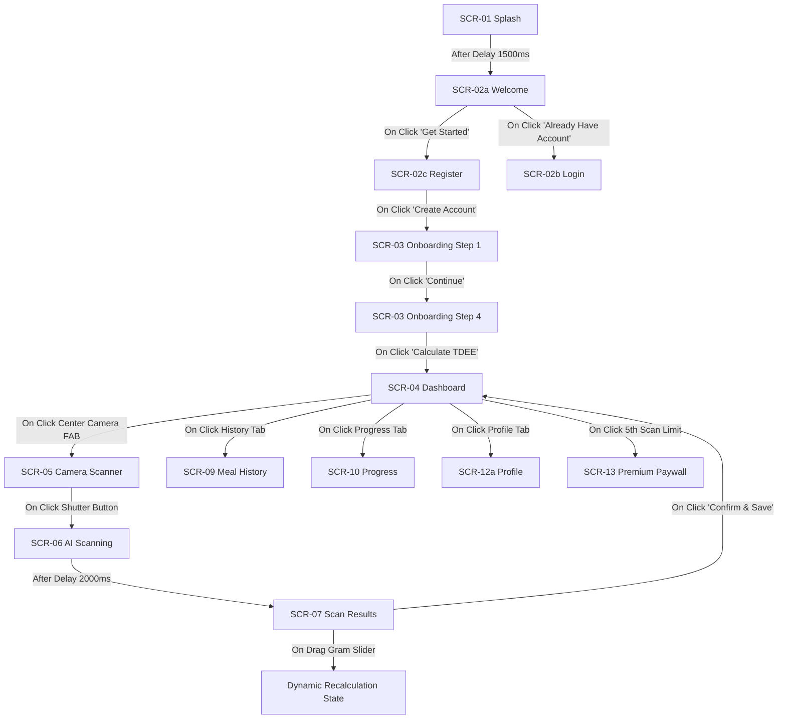

# FitFuel — Figma Design System & Interactive Prototype Specification
**Official Figma Component Architecture, Variables, Screen Layouts & Prototype Map**

---

| Document Version | Lead Architect | Target Resolution | Primary Design System | Material Version |
| :--- | :--- | :--- | :--- | :--- |
| **1.0.0-FIGMA** | Senior Product Designer | 390 x 844 px (iPhone 15 Standard) | FitFuel Glass-Emerald System | Material 3 Hybrid |

---

## Executive Summary

This document provides the complete, production-ready **Figma Design Specification and Interactive Prototype Plan** for the **FitFuel** mobile application. Grounded in the approved `SOFTWARE_PLANNING_DOCUMENT.md` and `FITFUEL_UI_UX_DESIGN_SPECIFICATION.md`, this blueprint equips UI designers and developers with every detail required to construct, maintain, or generate the Figma design file.

It defines the exact **Figma Variables (Light/Dark mode tokens)**, **Auto Layout rules**, **Component Variants**, **18 Screen Layout Specs (across Default, Empty, Loading, Error, and Success states)**, and an **End-to-End Interactive Prototype Map**.

---

## Table of Contents
1. [Figma File Architecture & Page Taxonomy](#1-figma-file-architecture--page-taxonomy)
2. [Figma Variables & Design Tokens](#2-figma-variables--design-tokens)
3. [Typography & Text Styles](#3-typography--text-styles)
4. [Auto Layout Component Library & Variants](#4-auto-layout-component-library--variants)
5. [Complete Screen Specifications (18 Screens x 5 States)](#5-complete-screen-specifications)
6. [Interactive Prototype Node Connection Map](#6-interactive-prototype-node-connection-map)
7. [Micro-Interaction & Physics Motion Specification](#7-micro-interaction--physics-motion-specification)
8. [Figma-to-Flutter Handoff & Naming Conventions](#8-figma-to-flutter-handoff--naming-conventions)
9. [Design Quality & QA Verification Checklist](#9-design-quality--qa-verification-checklist)
10. [Deliverables & Handoff Summary](#10-deliverables--handoff-summary)

---

## 1. Figma File Architecture & Page Taxonomy

To maintain a clean, enterprise-grade Figma workspace, the file is organized into 5 dedicated pages:

```
❖ FitFuel - Master Production Design.fig
├── Page 1: ❖ Cover & Overview
│   └── File Thumbnail Card, Version Log, Contributor List, Quick Links
├── Page 2: 🎨 Design System & Variables
│   └── Color Variables (Light/Dark Modes), Typography Styles, Spacing/Radius/Elevation Tokens
├── Page 3: 🧩 Components & Variants
│   └── Buttons, Inputs, Cards, Rings, Sliders, Modals, Snackbars, Navigation Bars
├── Page 4: 📱 Screens & Layouts
│   └── 18 Application Screens (390 x 844 px) in Light Mode (Primary) & Dark Mode (Secondary)
└── Page 5: ⚡ Interactive Prototype
    └── Connected Flow Wiring Diagram (Splash -> Auth -> Onboarding -> Camera Scan -> Results -> Dashboard)
```

---

## 2. Figma Variables & Design Tokens

FitFuel uses **Figma Variables** with multi-mode switching (**Light Mode** as Default, **Dark Mode** as Mode 2).

### 2.1 Color Variable Collection

```
Collection Name: Color
Modes: Light Mode (Default) | Dark Mode
```

| Variable Name | Light Mode Value (HEX) | Dark Mode Value (HEX) | Target Usage / Role |
| :--- | :--- | :--- | :--- |
| `color/primary/500` | `#059669` | `#10B981` | Brand Primary, CTA Buttons, Active FAB |
| `color/primary/400` | `#10B981` | `#34D399` | Hover State, Neon Ring Glow Accent |
| `color/primary/100` | `#ECFDF5` | `#064E3B` | Tinted Card Surfaces, Active Badges |
| `color/accent/protein` | `#EA580C` | `#F97316` | Protein Macro Bars, Flame Icons |
| `color/accent/carbs` | `#2563EB` | `#3B82F6` | Carbs Macro Bars, Grain Icons |
| `color/accent/fats` | `#7C3AED` | `#8B5CF6` | Fat Macro Bars, Avocado/Drop Icons |
| `color/accent/water` | `#0284C7` | `#06B6D4` | Water Hydration Widget & Wave Fill |
| `color/bg/base` | `#F8FAFC` | `#0F172A` | Screen Canvas Background |
| `color/bg/surface` | `#FFFFFF` | `#1E293B` | Card Surfaces, Bottom Sheets |
| `color/bg/surface-glass` | `rgba(255, 255, 255, 0.85)` | `rgba(30, 41, 59, 0.80)` | Glassmorphism Frosted Panels |
| `color/text/primary` | `#0F172A` | `#F8FAFC` | Main Titles, Headlines, Values |
| `color/text/secondary` | `#475569` | `#94A3B8` | Body Copy, Captions, Labels |
| `color/text/muted` | `#94A3B8` | `#64748B` | Disabled Text, Input Placeholders |
| `color/border/subtle` | `#E2E8F0` | `#334155` | 1px Card Borders, Dividers |
| `color/border/focus` | `#059669` | `#10B981` | Active Text Input Stroke |
| `color/state/success` | `#059669` | `#10B981` | Success Toast, Target Met Indicator |
| `color/state/warning` | `#D97706` | `#F59E0B` | Calorie Warning, High Sodium Banner |
| `color/state/error` | `#DC2626` | `#EF4444` | Validation Errors, Disconnected State |

### 2.2 Number Variable Collections

```
Collection Name: Spacing & Layout (8-Point Grid)
Variables:
  spacing/xs = 4px
  spacing/sm = 8px
  spacing/md = 16px
  spacing/lg = 24px
  spacing/xl = 32px
  spacing/2xl = 48px

Collection Name: Corner Radius
Variables:
  radius/xs = 4px
  radius/sm = 8px
  radius/md = 12px
  radius/lg = 16px
  radius/xl = 24px
  radius/full = 999px
```

---

## 3. Typography & Text Styles

Typography combines **Plus Jakarta Sans** (UI & Body) and **Outfit** (Numbers & Display Metrics).

### 3.1 Figma Text Styles Matrix

| Figma Style Name | Font Family | Size (px) | Line Height (px) | Weight | Letter Spacing |
| :--- | :--- | :--- | :--- | :--- | :--- |
| `Display/Large` | Outfit | 36px | 44px | Bold (700) | -0.02em |
| `Display/Medium` | Outfit | 28px | 36px | Bold (700) | -0.01em |
| `Heading/H1` | Plus Jakarta Sans | 24px | 32px | SemiBold (600) | 0.00em |
| `Heading/H2` | Plus Jakarta Sans | 20px | 28px | SemiBold (600) | 0.00em |
| `Heading/H3` | Plus Jakarta Sans | 18px | 24px | Medium (500) | 0.00em |
| `Body/Large` | Plus Jakarta Sans | 16px | 24px | Regular (400) | 0.00em |
| `Body/Medium` | Plus Jakarta Sans | 14px | 20px | Regular (400) | 0.01em |
| `Body/Small` | Plus Jakarta Sans | 12px | 16px | Medium (500) | 0.02em |
| `Caption/Regular` | Plus Jakarta Sans | 11px | 14px | Regular (400) | 0.02em |
| `Button/Label` | Plus Jakarta Sans | 15px | 20px | SemiBold (600) | 0.01em |

---

## 4. Auto Layout Component Library & Variants

All components use **Figma Auto Layout (Shift + A)** with explicit Sizing rules (`Fill container`, `Hug contents`, or `Fixed`).

```
                              COMPONENT VARIANT TAXONOMY
┌─────────────────────────────────────────────────────────────────────────────────────┐
│ Component: Button                                                                   │
│ Variants: Type = [Primary, Secondary, Ghost, Icon] | Size = [Large, Medium, Small]  │
│           State = [Default, Hover, Pressed, Disabled, Loading]                      │
└─────────────────────────────────────────────────────────────────────────────────────┘
```

### 4.1 Reusable Component Specifications

#### Component 1: `Button / Primary`
* **Auto Layout Settings:** Direction = Horizontal, Padding = `16px` Left/Right, `14px` Top/Bottom, Gap = `8px`, Alignment = Center.
* **Sizing:** Width = Fill container (or Hug), Height = `52px` (Large) / `44px` (Medium).
* **Styling:** Fill = `color/primary/500`, Radius = `radius/full` (999px), Text = `Button/Label` in `#FFFFFF`.
* **Variants:**
  * `State=Default`: Normal fill.
  * `State=Pressed`: Scale transform `0.96`, background `color/primary/400`.
  * `State=Disabled`: Background `color/text/muted` (30% opacity), text opacity 50%.
  * `State=Loading`: Replaces label text with a centered 20px SVG Progress Spinner.

#### Component 2: `Input Field`
* **Auto Layout Settings:** Direction = Vertical, Gap = `6px`, Width = Fill container.
* **Input Box Frame:** Height = `52px`, Padding = `16px` Horizontal, Alignment = Left, Radius = `radius/md` (12px), Fill = `color/bg/surface`, Stroke = `1px solid color/border/subtle`.
* **Variants:**
  * `State=Default`: Subtle border.
  * `State=Focused`: Stroke = `2px solid color/border/focus`.
  * `State=Error`: Stroke = `2px solid color/state/error`, displays helper text frame below in red.

#### Component 3: `Calorie Progress Ring (Dual Arc)`
* **Structure:** Frame dimensions `220 x 220 px`. Centered Auto Layout Stack.
* **Outer Track Arc:** SVG Circular Path, stroke width = `12px`, color = `color/border/subtle`.
* **Active Progress Arc:** SVG Gradient Path (`color/primary/500` to `color/primary/400`), stroke width = `12px`.
* **Center Content Stack:**
  * Line 1: `1,450` (`Display/Large` typography).
  * Line 2: "Calories Remaining" (`Body/Small` typography in `color/text/secondary`).

#### Component 4: `Macro Linear Progress Bar`
* **Structure:** Auto Layout Horizontal Box, Height = `8px`, Radius = `radius/full`, Fill = `color/border/subtle`.
* **Inner Fill Bar:** Height = Fill, Radius = `radius/full`, Fill = `color/accent/protein` (or Carbs/Fats). Auto Layout width set to percentage (e.g. 75%).

#### Component 5: `Interactive Gram Slider`
* **Structure:** Auto Layout Box, Width = Fill container, Height = `40px`.
* **Track:** Line height `6px`, Fill `color/border/subtle`.
* **Thumb:** Circular Frame `28 x 28 px`, Fill = `color/bg/surface`, Stroke = `3px solid color/primary/500`, Shadow = `Elevation 2`.
* **Value Bubble Tooltip:** Floating badge pinned above thumb displaying `"180g"`.

#### Component 6: `Food Item Card`
* **Auto Layout Settings:** Direction = Horizontal, Padding = `12px`, Gap = `12px`, Alignment = Center Left, Fill = `color/bg/surface`, Radius = `radius/md`, Stroke = `1px solid color/border/subtle`.
* **Child Nodes:**
  1. Image Frame (`48x48px`, Radius = 8px, Clip content).
  2. Text Stack (Vertical, Gap = 2px, Fill container): Title (`Heading/H3`), Weight Badge (`150g`).
  3. Macro Tags Row (Horizontal, Gap = 4px): Protein Chip, Carbs Chip, Fat Chip.
  4. Trailing Action: Trash Delete Icon Button (`24x24px`).

#### Component 7: `Bottom Navigation Bar`
* **Structure:** Width = `390px`, Height = `84px`, Radius = `24px Top-Left/Right`, Fill = `color/bg/surface-glass`, Backdrop Blur = `16px`.
* **Items Row:** Auto Layout Horizontal, Space Between, Padding = `12px 24px`.
* **Navigation Items:**
  * Tab 1: Dashboard (Icon + Label)
  * Tab 2: History (Icon + Label)
  * **Center FAB:** Pinned cutout frame (`64x64px`), Circular, Fill = `color/primary/500`, Shadow = `Elevation FAB`, Icon = 3D Camera.
  * Tab 3: Progress (Icon + Label)
  * Tab 4: Profile (Icon + Label)

---

## 5. Complete Screen Specifications

Here are the detailed frame specifications for all **18 application screens** (Frame dimensions: `390 x 844 px`). Each screen includes its **Default, Empty, Loading, Error, and Success** UI states.

---

### SCR-01: Splash Screen
* **Frame Name:** `SCR-01_Splash`
* **Auto Layout:** Centered Vertical Stack, Fill = `color/bg/base`.
* **Layers Hierarchy:**
  * `Frame_Content`: Centered stack.
    * `Img_Logo`: 3D FitFuel Emerald Glyph (`96x96px`).
    * `Txt_Brand`: "FitFuel" (`Display/Large` typography).
    * `Txt_Tagline`: "AI Nutrition Assistant" (`Body/Medium`).
    * `Spacer`: `48px`.
    * `Cmp_Spinner`: 24px Circular Loader.
* **States Specs:**
  * **Default/Loading:** Spinner rotating.
  * **Error:** Replaces spinner with "Network Error. Retrying..." text + Retry button.

---

### SCR-02a: Welcome Screen
* **Frame Name:** `SCR-02a_Welcome`
* **Auto Layout:** Vertical Stack, Fill = `color/bg/base`.
* **Layers Hierarchy:**
  * `Frame_Hero_Artwork`: Height `480px`, 3D Glassmorphic Food Camera Illustration.
  * `Frame_Actions`: Padding `24px`, Gap `16px`, Radius `24px Top-Left/Right`, Fill = `color/bg/surface`.
    * `Txt_Headline`: "AI-Powered Nutrition in 3 Seconds" (`Display/Medium`).
    * `Txt_Subtitle`: "Point your camera at any meal to track calories instantly." (`Body/Medium`).
    * `Btn_Primary`: "Get Started" (`Button/Primary`).
    * `Btn_Secondary`: "I Already Have an Account" (`Button/Ghost`).

---

### SCR-02b: Login Screen
* **Frame Name:** `SCR-02b_Login`
* **Auto Layout:** Vertical Scroll Stack, Padding = `24px`.
* **Layers Hierarchy:**
  * `Nav_TopBar`: Back Arrow Icon Button (`24x24px`).
  * `Txt_Title`: "Welcome Back" (`Display/Medium`).
  * `Txt_Sub`: "Sign in to continue tracking" (`Body/Medium`).
  * `Form_Stack`: Gap = `16px`.
    * `Input_Email`: `Input Field / Default`.
    * `Input_Password`: `Input Field / Password` (with Eye icon).
    * `Txt_ForgotPassword`: Right-aligned text link.
    * `Btn_Submit`: "Sign In" (`Button/Primary`).
  * `Divider_Row`: Text "or continue with".
  * `Social_Row`: Google OAuth Button + Apple ID Button.
* **States Specs:**
  * **Error State:** `Input_Password` set to `State=Error`, inline banner "Invalid email or password."
  * **Loading State:** `Btn_Submit` set to `State=Loading`.

---

### SCR-02c: Register Screen
* **Frame Name:** `SCR-02c_Register`
* **Layers Hierarchy:** Similar to Login with Full Name Input, Password Strength Meter Bar (Weak/Medium/Strong), and Terms Acceptance Checkbox.
* **States Specs:**
  * **Success State:** Redirects directly to Onboarding Stepper.

---

### SCR-02d: Forgot Password Screen
* **Frame Name:** `SCR-02d_ForgotPassword`
* **Layers Hierarchy:** Key illustration icon, Title ("Reset Password"), Email Input, Send Reset Link Button.
* **States Specs:**
  * **Success State:** Replaces input form with green checkmark vector + "Reset link sent to your email!".

---

### SCR-03: Onboarding Stepper (Steps 1–4)
* **Frame Name:** `SCR-03_Onboarding_Step[1-4]`
* **Auto Layout:** Vertical Stack, Top Stepper Bar (`Step X of 4`).
* **Step Breakdown:**
  * **Step 1 (Bio Data):** Gender Selection Cards (Male, Female, Non-Binary) + Age Wheel Picker.
  * **Step 2 (Body Metrics):** Height Slider & Weight Input with Segmented Unit Toggle (Metric kg vs Imperial lbs).
  * **Step 3 (Activity Level):** Selectable Cards (Sedentary, Lightly Active, Moderately Active, Very Active).
  * **Step 4 (Primary Goal):** Selectable Cards (Fat Loss, Weight Maintenance, Muscle Gain) + Target Weight Input.
* **Bottom Action:** Persistent "Continue" Button (`Button/Primary`).

---

### SCR-04: Main Dashboard
* **Frame Name:** `SCR-04_Dashboard`
* **Auto Layout:** Vertical Scroll Stack, Bottom Padding `100px` for Nav Bar.
* **Layers Hierarchy:**
  * `Header_Row`: User Avatar (`40x40px`), Greeting "Hello, Alex! 👋", Date Picker Selector Bar.
  * `Card_Calorie_Summary`: Fill = `color/bg/surface`, Padding = `20px`, Radius = `16px`.
    * Contains `Calorie Progress Ring (Dual Arc)` + Remaining Calories Text.
  * `Grid_Macro_Progress`: 3 Horizontal Macro Cards (Protein, Carbs, Fats) with linear bars.
  * `Widget_Water_Tracker`: Fill = `color/accent/water` (10% tint), Animated Water Wave Fill, Quick `+250ml` and `+500ml` Buttons.
  * `Section_Daily_Meals`: Meal Accordions (Breakfast, Lunch, Dinner, Snacks) with food cards.
  * `Banner_AI_Insight`: Compact suggestion card with green glow.
* **States Specs:**
  * **Empty State:** `Section_Daily_Meals` displays "No meals logged today. Tap camera to scan!" + empty plate artwork.
  * **Loading State:** Skeleton Screen placeholders for rings and cards.

---

### SCR-05: Camera Scanner Screen
* **Frame Name:** `SCR-05_Camera_Scanner`
* **Layout:** Full-screen camera viewfinder preview background.
* **Layers Hierarchy:**
  * `Top_Controls`: Close (X) Icon, Flash Toggle (Auto/On/Off), Grid Overlay Button.
  * `Target_Reticle`: Square Glass Reticle Frame (`280x280px`), Rounded Corners, Tip Text "Align meal plate within frame".
  * `Bottom_Bar`: Gallery Image Picker Thumbnail (left), Primary Shutter Button (center, `72x72px` emerald ring), Text Search Button (right).

---

### SCR-06: AI Scanning Processing Screen
* **Frame Name:** `SCR-06_AI_Scanning`
* **Layout:** Frosted dark background overlay (`#0F172A` with blur) over captured photo.
* **Components:** Pulsing 3D Laser Scanning Line moving vertically, Animated Status Text Switcher ("Analyzing image...", "Identifying food items...", "Calculating macros..."), Cancel Button.

---

### SCR-07: Scan Results & Edit Screen
* **Frame Name:** `SCR-07_Scan_Results`
* **Layout:** Top 40% captured photo with item highlight pins; Bottom 60% draggable Bottom Sheet.
* **Layers Hierarchy:**
  * `Card_Overall_Meal`: Match Confidence Badge (`94% Match`), Total Calories (`650 kcal`).
  * `List_Detected_Items`: Stack of `Food Item Cards`. Each card includes food title, macro tags, trash delete icon, and `Interactive Gram Slider`.
  * `Btn_Confirm`: "Confirm & Save Log" (`Button/Primary`).

---

### SCR-08: Manual Food Search & SCR-08b: Meal Detail Modal
* **SCR-08 Manual Search:** Search Input Bar, Recent Chips, Search Result Cards list, "+ Custom Food" button.
* **SCR-08b Meal Detail:** Slide-up Modal Sheet, Photo thumbnail, Itemized ingredients list, Edit Grams button, Delete Meal button.

---

### SCR-09: Meal History & Calendar Screen
* **Frame Name:** `SCR-09_Meal_History`
* **Layers Hierarchy:** Monthly Calendar Strip (Date dots: Green = Target Met, Yellow = Over/Under, Grey = Empty), Daily Macro Summary Card, Historical Log Timeline.
* **States Specs:**
  * **Empty State:** "No meal history for this date" + 3D Glass Calendar Artwork.

---

### SCR-10: Progress & Analytics Screen
* **Frame Name:** `SCR-10_Progress`
* **Layers Hierarchy:** Segmented Time Filter Bar (`7D`, `30D`, `90D`, `1Y`), Weight Loss Trend Line Chart (Cubic Spline), Calorie Adherence Bar Chart, Macro Distribution Donut Chart, Summary Stats Cards Grid.

---

### SCR-11: AI Insights Feed & SCR-11b: Notifications
* **SCR-11 AI Insights:** Filter Chips ("All", "Warnings", "Suggestions"), Insight Cards Feed (Icon, Title, Rich Description, Recommendation Action Button).
* **SCR-11b Notifications:** List of notification cards with read/unread status dots.

---

### SCR-12a: Profile & SCR-12b: Settings
* **SCR-12a Profile:** Avatar Card, Bio Data Summary (Age, Height, Weight, TDEE Target), Pro Subscription Badge.
* **SCR-12b Settings:** Preferences Group (Unit System Toggle, Theme Selector), Notifications Group, Account & Security Group, Danger Zone Log Out Button.

---

### SCR-13: FitFuel Premium Paywall Screen
* **Frame Name:** `SCR-13_Premium_Paywall`
* **Layers Hierarchy:** Hero 3D Pro Badge, Headline ("Unlock FitFuel Pro"), Value Checklist (Unlimited AI Scans, Deep Analytics, Lifetime History), Plan Selector Cards (Annual $59.99/yr - 50% OFF Badge, Monthly $9.99/mo), "Start 7-Day Free Trial" Button.

---

## 6. Interactive Prototype Node Connection Map

The Figma prototype connects all screens into a complete end-to-end user journey:



### Prototype Transition Settings
* **Screen Transitions:** `Push` / `Slide In` (Right-to-Left), Duration = `300ms`, Easing = `Ease Out Cubic`.
* **Modal Bottom Sheets:** `Open Overlay` (Bottom-to-Top), Background = `Black 50% opacity`, Easing = `Ease Out Quad`.
* **Interactive Sliders:** `Smart Animate` component variant state changes.

---

## 7. Micro-Interaction & Physics Motion Specification

| Action / Trigger | UI Response | Animation Curve | Duration | Haptic Feedback |
| :--- | :--- | :--- | :--- | :--- |
| **Primary Button Press** | Scale down to `0.96`, return to `1.0` | `Ease Out Back` | 150ms | `HapticFeedback.lightImpact()` |
| **Dashboard Ring Load** | Dual Arc fills from `0%` to target fill | `Elastic Out` | 800ms | None |
| **Gram Slider Drag** | Slider thumb glows, tooltip badge expands | `Linear` | Real-time | `HapticFeedback.selectionClick()` |
| **Water Tracker Tap** | Fluid blue wave fills widget container | `Ease In Out Quad` | 500ms | `HapticFeedback.mediumImpact()` |
| **AI Scan Complete** | Scanning overlay fades out, results sheet slides up | `Ease Out Expo` | 400ms | `HapticFeedback.heavyImpact()` |

---

## 8. Figma-to-Flutter Handoff & Naming Conventions

Every layer in Figma is named systematically to correspond directly to Flutter widgets and BLoC components:

```
Figma Layer Name Format:     [Type]_[Name]_[State]
Flutter Widget Class:        FitFuel[Name][Type]
```

### Mapping Table

| Figma Layer Name | Flutter Widget Mapping | State Management Trigger |
| :--- | :--- | :--- |
| `Btn_Confirm_Primary` | `FitFuelPrimaryButton` | `DashboardBloc.add(SaveMealEvent())` |
| `Input_Email_Default` | `FitFuelTextField` | `AuthBloc.add(EmailChangedEvent())` |
| `Ring_Calorie_Summary` | `FitFuelMacroRingPainter` | `DashboardBloc.state.remainingCalories` |
| `Slider_Gram_Portion` | `FitFuelGramSlider` | `ScanBloc.add(UpdateGramWeightEvent())` |
| `Nav_Bottom_Bar` | `FitFuelBottomNavigationBar` | `NavigationCubit.selectTab(index)` |

---

## 9. Design Quality & QA Verification Checklist

Before releasing Figma designs to Flutter developers:

- [x] Every color variable is linked to the dual-mode Variable Collection (`Light Mode` / `Dark Mode`).
- [x] All text elements use defined Figma Text Styles (`Plus Jakarta Sans` / `Outfit`).
- [x] Component paddings and gaps strictly follow the `8-Point Spacing Grid`.
- [x] Interactive touch targets are $\ge 48 \times 48\text{ px}$.
- [x] Contrast ratio meets WCAG 2.1 Level AA ($\ge 4.5:1$ text, $\ge 3:1$ UI components).
- [x] All 18 screens include explicit Default, Empty, Loading, and Error states.
- [x] Prototype connections are tested without dead-end frames.

---

## 10. Deliverables & Handoff Summary

The Figma design phase yields the following complete artifacts:

1. **Master Figma Specification Document (`FIGMA_DESIGN_SYSTEM_AND_PROTOTYPE_SPECIFICATION.md`)**
2. **Complete Dual-Mode Variable Tokens (Colors, Spacing, Radius, Typography)**
3. **Auto Layout Component Library with Reusable Variants**
4. **18-Screen Production Wireframe Specifications (5 States per screen)**
5. **Interactive Prototype Node Connection Map & Micro-Interaction Guide**
6. **Figma-to-Flutter Naming & Code Handoff Matrix**

---
*End of Figma Design System & Prototype Specification Document.*
