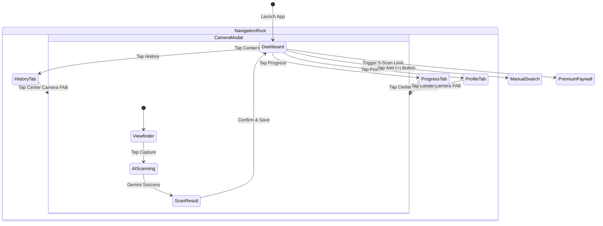
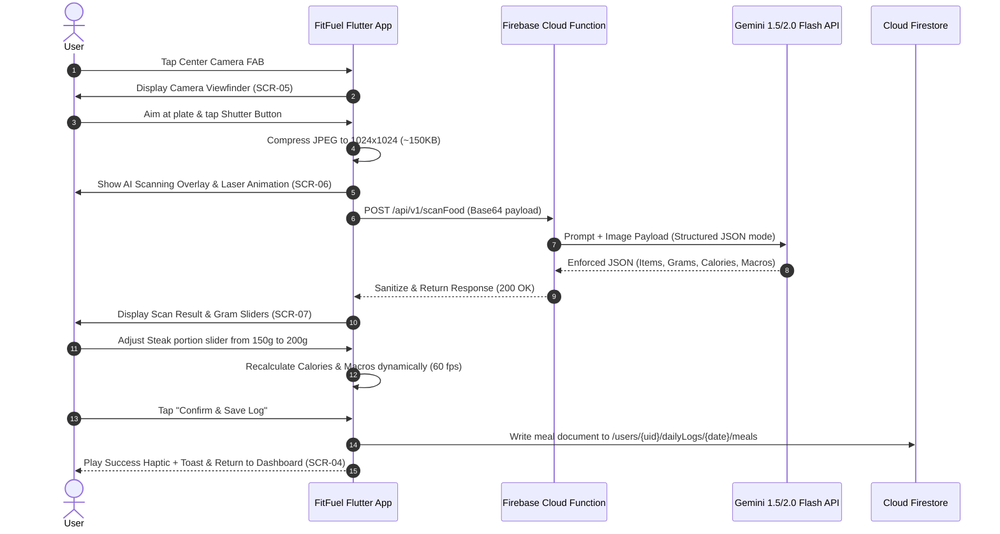

# FitFuel — Master UI/UX Design Specification & Design System
**AI-Powered Nutrition, Calorie Tracking & Healthy Eating Mobile Assistant**

---

| Document Version | Design Lead & Architect | Target Platforms | Primary Design System | Benchmark Compliance |
| :--- | :--- | :--- | :--- | :--- |
| **1.0.0-DESIGN** | Lead Product Designer & Design System Architect | iOS (Apple Human Interface Guidelines) & Android (Material 3) | FitFuel Glass-Emerald Design System | WCAG 2.1 Level AA / Apple & Google Standards |

---

## Executive Summary

This document serves as the official, comprehensive **UI/UX Design Specification & Design System** for **FitFuel**. Built to seamlessly complement the engineering and business requirements outlined in `SOFTWARE_PLANNING_DOCUMENT.md`, this specification bridges human-centered design with high-performance Flutter mobile architecture.

FitFuel’s core value proposition—**sub-5-second meal logging via Google Gemini Vision AI**—demands an interface that feels instant, hyper-focused, tactile, and encouraging. This document establishes the exact visual rules, design tokens, component library, 18-screen layout specs, navigation patterns, micro-animations, accessibility guidelines, and developer handoff protocols required to craft an app store award-caliber product.

---

## Table of Contents
1. [Design Vision](#1-design-vision)
2. [Design System & Color Palette](#2-design-system--color-palette)
3. [Typography System](#3-typography-system)
4. [Spacing System](#4-spacing-system)
5. [Border Radius System](#5-border-radius-system)
6. [Shadows & Elevation](#6-shadows--elevation)
7. [Iconography](#7-iconography)
8. [Illustrations & Artwork](#8-illustrations--artwork)
9. [Component Library Specification](#9-component-library-specification)
10. [Complete Screen Specifications (18 Screens)](#10-complete-screen-specifications)
11. [Navigation Architecture](#11-navigation-architecture)
12. [User Experience Flows](#12-user-experience-flows)
13. [Motion Design & Micro-Interactions](#13-motion-design--micro-interactions)
14. [Accessibility Specification](#14-accessibility-specification)
15. [Responsive & Cross-Device Layouts](#15-responsive--cross-device-layouts)
16. [Figma File Organization](#16-figma-file-organization)
17. [Design Tokens (JSON Spec)](#17-design-tokens-json-spec)
18. [Developer Handoff Guidelines](#18-developer-handoff-guidelines)
19. [Design Quality Review Checklist](#19-design-quality-review-checklist)
20. [Deliverables Summary](#20-deliverables-summary)

---

## 1. Design Vision

### 1.1 Product Personality
FitFuel is **Energizing, Effortless, Intelligent, and Empathetic**. It avoids the sterile, clinical feel of legacy medical apps and the chaotic, ad-cluttered feel of traditional calorie trackers. Instead, it feels like a high-end personal health coach inside a sleek, dark-mode-first aesthetic.

### 1.2 Design Principles
1. **Frictionless First:** Every millisecond matters. Reduce taps to the bare minimum. The camera action is always one tap away from anywhere in the app.
2. **Visual Hierarchy Over Text Density:** Use dynamic rings, colored macro pills, and clear visual indicators to communicate nutritional balance at a single glance.
3. **Data Transparency & User Agency:** AI estimations are presented with high clarity, but the user is always empowered with frictionless 1-tap correction tools (grams slider).
4. **Micro-Feedback Delight:** Reward healthy behaviors (logging a meal, hitting water goals, staying within target) with subtle fluid animations and haptic feedback.

### 1.3 Brand Identity & Visual Direction
* **Color Mood:** Premium Dark Slate base (`#0F172A`) paired with vibrant Emerald Green (`#10B981`) representing vitality, health, and AI precision.
* **Material Style:** **Modern Glassmorphism & Soft Neumorphism**. Translucent frosted surfaces (`backdrop-filter: blur(16px)`), subtle 1px inner stroke highlights, and vibrant neon accent glows against dark canvas backgrounds.

---

## 2. Design System & Color Palette

FitFuel features a dual-theme architecture (Dark Mode default, Light Mode secondary) designed with high contrast and WCAG 2.1 AA compliance.

```
                  FITFUEL COLOR PALETTE ARCHITECTURE
┌──────────────────────────────────────────────────────────────────┐
│ Primary Base: Emerald Green (#10B981) - Health, Balance, Vitality  │
│ Dark Canvas:  Deep Slate (#0F172A)    - Premium Sleek Atmosphere  │
└──────────────────────────────────────────────────────────────────┘
  ├── Protein Accent:  Electric Orange (#F97316)
  ├── Carbs Accent:    Vibrant Blue   (#3B82F6)
  ├── Fats Accent:     Warm Purple    (#8B5CF6)
  └── Water Accent:    Cyan Hydro     (#06B6D4)
```

### 2.1 Complete Color Token Table

| Token Name | Role / Usage | Dark Mode HEX | Light Mode HEX | WCAG Contrast |
| :--- | :--- | :--- | :--- | :--- |
| `color-primary-500` | Primary Brand, Active States, Main FAB | `#10B981` | `#059669` | 4.8:1 (AA) |
| `color-primary-400` | Primary Hover / Glow Accent | `#34D399` | `#10B981` | 6.2:1 (AA) |
| `color-primary-900` | Tinted Card Backgrounds | `#064E3B` | `#ECFDF5` | N/A (Surface) |
| `color-accent-protein` | Protein Macro Indicators / Rings | `#F97316` | `#EA580C` | 4.6:1 (AA) |
| `color-accent-carbs` | Carbohydrate Macro Indicators | `#3B82F6` | `#2563EB` | 5.1:1 (AA) |
| `color-accent-fats` | Fat Macro Indicators | `#8B5CF6` | `#7C3AED` | 4.9:1 (AA) |
| `color-accent-water` | Water Hydration Widget / Animation | `#06B6D4` | `#0284C7` | 5.3:1 (AA) |
| `color-bg-base` | Main Screen Canvas Background | `#0F172A` | `#F8FAFC` | Base Canvas |
| `color-bg-surface` | Elevated Cards & Bottom Sheets | `#1E293B` | `#FFFFFF` | Base Surface |
| `color-bg-surface-glass` | Frosted Modals (80% Opacity + Blur) | `#1E293BCC` | `#FFFFFFE6` | Glass Overlay |
| `color-text-primary` | Headings, Primary Labels | `#F8FAFC` | `#0F172A` | 15.2:1 (AAA) |
| `color-text-secondary` | Body Copy, Subtitles, Dates | `#94A3B8` | `#475569` | 7.1:1 (AAA) |
| `color-text-muted` | Placeholders, Disabled Labels | `#64748B` | `#94A3B8` | 4.5:1 (AA) |
| `color-border-subtle` | 1px Card Divider / Subtle Stroke | `#334155` | `#E2E8F0` | Structural |
| `color-border-focus` | Active Input Field / Selection Stroke | `#10B981` | `#059669` | Focus State |
| `color-state-success` | Success Snackbars, Target Achieved | `#10B981` | `#059669` | Semantic |
| `color-state-warning` | Over-calorie Alert, High Sodium | `#F59E0B` | `#D97706` | Semantic |
| `color-state-error` | Scan Failed, Network Disconnected | `#EF4444` | `#DC2626` | Semantic |
| `color-state-info` | AI Health Tip Card Background | `#3B82F6` | `#2563EB` | Semantic |

---

## 3. Typography System

FitFuel utilizes **Plus Jakarta Sans** (Google Fonts) as its primary typeface due to its geometric modern structure, crisp legibility at small sizes, and friendly rounded terminals. Display numbers (calories/macros) utilize **Outfit**.

### 3.1 Type Scale Hierarchy Table

| Style Name | Font Family | Size (sp/pt) | Line Height | Weight | Letter Spacing | Target Usage |
| :--- | :--- | :--- | :--- | :--- | :--- | :--- |
| `display-large` | Outfit | 36 pt | 44 pt | Bold (700) | -0.02 em | Dashboard Calorie Count, Big Metrics |
| `display-medium` | Outfit | 28 pt | 36 pt | Bold (700) | -0.01 em | Screen Title Headers, Onboarding Hero |
| `heading-1` | Plus Jakarta Sans | 24 pt | 32 pt | SemiBold (600) | 0.00 em | Section Titles, Modal Headers |
| `heading-2` | Plus Jakarta Sans | 20 pt | 28 pt | SemiBold (600) | 0.00 em | Card Headers, Meal Group Titles |
| `heading-3` | Plus Jakarta Sans | 18 pt | 24 pt | Medium (500) | 0.00 em | Food Item Titles, Sub-headings |
| `body-large` | Plus Jakarta Sans | 16 pt | 24 pt | Regular (400) | 0.00 em | Primary Body Text, Input Field Text |
| `body-medium` | Plus Jakarta Sans | 14 pt | 20 pt | Regular (400) | 0.01 em | Secondary Card Text, Descriptions |
| `body-small` | Plus Jakarta Sans | 12 pt | 16 pt | Medium (500) | 0.02 em | Badges, Timestamp Labels |
| `caption` | Plus Jakarta Sans | 11 pt | 14 pt | Regular (400) | 0.02 em | Micro Disclaimer, Footer Notes |
| `button-label` | Plus Jakarta Sans | 15 pt | 20 pt | SemiBold (600) | 0.01 em | Primary & Secondary CTA Buttons |

---

## 4. Spacing System

FitFuel strictly follows an **8-Point Base Grid System** (with a 4-point micro-grid for fine alignment).

```
4px   - Micro Spacing (Icon-to-text gap, badge padding)
8px   - Compact Spacing (Inside input padding, stacked item gaps)
16px  - Standard Spacing (Card inner padding, default container margins)
24px  - Section Spacing (Gaps between dashboard cards, grid gaps)
32px  - Major Section Divider (Header to content separation)
48px  - Screen Edge Padding (Top splash offset, Hero header space)
```

### 4.1 Layout Boundaries
* **Screen Edge Margin:** `16dp` on Mobile (< 600dp), `24dp` on Tablet ($\ge$ 600dp).
* **Card Inner Padding:** `16dp` uniform.
* **Component Vertical Stack Gap:** `12dp` standard.

---

## 5. Border Radius System

FitFuel uses distinct rounded corner scales to convey friendly touchability while maintaining architectural precision:

| Radius Name | Value (dp) | Application Targets |
| :--- | :--- | :--- |
| `radius-xs` | `4dp` | Tooltips, micro progress indicators |
| `radius-sm` | `8dp` | Tags, badges, text field inputs, small buttons |
| `radius-md` | `12dp` | Standard food cards, dropdown menus, alert dialogs |
| `radius-lg` | `16dp` | Major dashboard container cards, glassmorphic panels |
| `radius-xl` | `24dp` | Bottom Sheet modals, top navigation headers |
| `radius-full` | `999dp` | Pill buttons, Floating Action Button (FAB), Avatar circles |

---

## 6. Shadows & Elevation

Elevations are rendered using multi-layered soft drop shadows in Light Mode and ambient neon glows in Dark Mode.

### 6.1 Elevation Level Table

| Elevation Level | Dark Mode Effect (Glow / Shadow) | Light Mode Effect | Target Component |
| :--- | :--- | :--- | :--- |
| `elevation-0` | None (Flat surface) | None | Flat inline containers |
| `elevation-1` | `0px 4px 20px rgba(0, 0, 0, 0.4)` | `0px 2px 8px rgba(15, 23, 42, 0.06)` | Dashboard cards, Meal list items |
| `elevation-2` | `0px 8px 32px rgba(0, 0, 0, 0.6)` | `0px 4px 16px rgba(15, 23, 42, 0.10)` | Dropdown menus, Sticky headers |
| `elevation-3` | `0px 12px 48px rgba(0, 0, 0, 0.8)` | `0px 8px 24px rgba(15, 23, 42, 0.15)` | Bottom Sheets, Dialog modals |
| `elevation-fab` | `0px 8px 24px rgba(16, 185, 129, 0.4)` | `0px 6px 20px rgba(16, 185, 129, 0.35)` | Center Floating Camera FAB |

---

## 7. Iconography

### 7.1 Recommended Library
FitFuel utilizes **Lucide Icons** (Vector SVG stroke icons) rendered with a standard **2.0px stroke weight** and rounded stroke caps/joins.

### 7.2 Icon Sizing Rules
* **Micro Icon (16x16 dp):** Used inline next to small text badges (e.g., flame icon next to calories).
* **Standard Action Icon (24x24 dp):** Used in app bar actions, bottom navigation items, and text input trailing icons.
* **Hero / Feature Icon (32x32 dp - 48x48 dp):** Used in empty states, camera controls, and onboarding highlights.
* **Touch Target Enclosure:** All interactive icons must be wrapped in a minimum **48x48 dp touch target box**.

---

## 8. Illustrations & Artwork

FitFuel adopts a **Modern 3D Geometric Glassmorphic Artwork Style**. Illustrations feature translucent floating geometric shapes (spheres, glass plates, vibrant green leaves, water droplets) with smooth ambient lighting.

```
ILLUSTRATION SCENARIO MATRIX
├── 1. Onboarding Art:       Floating 3D Camera Lens, Fresh Avocado & Protein Bar
├── 2. Empty History State:   3D Translucent Glass Calendar with subtle glowing star
├── 3. AI Scanning Overlay:   Pulsing 3D Glass Reticle with Laser Wave Grid
├── 4. Goal Success Modal:    3D Glowing Emerald Trophy with Floating Confetti
└── 5. Error / Offline State: 3D Cloud with Disconnected Plug & Alert Badge
```

---

## 9. Component Library Specification

Every reusable component in FitFuel is engineered with strict layout, state, and interaction rules:

### 9.1 Buttons
* **Primary CTA Button:** Pill-shaped (`radius-full`), height `52dp`, background `color-primary-500`, label text `button-label` in white. Includes ripple feedback and subtle depth shadow.
* **Secondary Glass Button:** Translucent background (`#1E293B`), height `48dp`, border `1px solid #334155`.
* **Ghost / Text Button:** No background, height `40dp`, primary color label with hover underline.

### 9.2 Text Fields
* **Height:** `52dp` single-line.
* **Default State:** Background `#1E293B`, border `1px solid #334155`, text `#F8FAFC`, placeholder `#64748B`.
* **Focused State:** Border `2px solid #10B981` with ambient primary glow.
* **Error State:** Border `2px solid #EF4444` with inline red validation error message below.

### 9.3 Custom Progress Rings & Bars
* **Calorie Summary Circular Ring:** Custom Dual-Arc painter (`strokeWidth: 12dp`). Base track `#334155`, active progress track rendered with a smooth gradient from `#10B981` to `#34D399`. Center content displays total remaining calories in `display-large` typography.
* **Macro Linear Progress Bars:** Height `8dp`, rounded caps (`radius-full`). Dedicated color coding: Protein (Orange `#F97316`), Carbs (Blue `#3B82F6`), Fats (Purple `#8B5CF6`).

### 9.4 Meal & Food Item Cards
* **Meal Group Header:** Displays meal type icon (e.g., Sun for Breakfast), title, total calories badge, and "+ Add" quick button.
* **Food Item Card:** Contains a 48x48dp food thumbnail, item title, weight in grams badge, and individual macro pill tags.
* **Interactive Gram Slider:** Custom slider track with an ergonomic thumb target (`28x28dp`). Dragging the slider dynamically recalculates calorie and macro numbers in real-time at 60 fps.

### 9.5 Floating Action Button (FAB)
* **Design:** Center-docked in the bottom navigation bar. Diameter `64dp`, circular, colored in `color-primary-500` with a 3D camera vector icon. Includes a pulsating outer aura glow animation (`elevation-fab`).

---

## 10. Complete Screen Specifications

Here are the complete UI/UX specifications for all **18 application screens**:

---

### SCR-01: Splash Screen
* **Purpose:** Initial boot loader, session verification, and brand entry point.
* **Layout:** Centered vertical stack on `#0F172A` background.
* **Components:** Animated 3D FitFuel Emerald Logo (scale + fade-in), circular smooth spinner loader at bottom.
* **Interactions:** Automatic state-driven routing: if auth token exists $\rightarrow$ Dashboard; else $\rightarrow$ Welcome Screen.
* **States:** Normal loading state; error state redirects to Auth.
* **Accessibility:** Screen reader announces "FitFuel, loading application".

---

### SCR-02a: Welcome Screen
* **Purpose:** Brand value introduction and authentication entry point.
* **Layout:** Full-screen hero layout. Top 60% features 3D glassmorphic food scanning artwork; bottom 40% features welcome headlines and authentication action stack.
* **Components:** Headline ("AI-Powered Nutrition in 3 Seconds"), Subtitle, Primary CTA Button ("Get Started"), Secondary Button ("I Already Have an Account").
* **Interactions:** Tap "Get Started" $\rightarrow$ Register/Onboarding; Tap "Already Have Account" $\rightarrow$ Login.

---

### SCR-02b: Login Screen
* **Purpose:** User authentication via email/password or social OAuth providers.
* **Layout:** Scrollable vertical form container with top navigation back arrow.
* **Components:** Page Title, Email Field, Password Field (with eye toggle icon), "Forgot Password?" text link, Primary "Sign In" Button, Divider ("or continue with"), Social OAuth Row (Google Sign-In, Apple ID).
* **Interactions:** Tap Sign In validates inputs and triggers Firebase Auth loader; Social buttons trigger OAuth bottom sheet.
* **Error State:** Red border on text fields + inline error banner ("Invalid credentials. Please try again.").

---

### SCR-02c: Register Screen
* **Purpose:** New user account creation.
* **Layout:** Similar to Login Screen with terms acceptance checkbox.
* **Components:** Full Name Input, Email Input, Password Input (with strength meter bar: Weak/Medium/Strong), Terms & Privacy Checkbox, "Create Account" CTA Button, Social OAuth buttons.
* **Interactions:** Tapping "Create Account" creates Firebase Auth user and immediately transitions into SCR-03 (Onboarding Wizard).

---

### SCR-02d: Forgot Password Screen
* **Purpose:** Password reset request via email.
* **Layout:** Focused single-card form overlay.
* **Components:** Key illustration icon, Title ("Reset Password"), Description text, Email input field, "Send Reset Link" Button, "Back to Login" text button.
* **States:** Success state replaces input form with a green checkmark illustration and confirmation text ("Reset link sent! Check your inbox.").

---

### SCR-03: Onboarding Stepper (Bio Setup & Goals)
* **Purpose:** Collect age, height, weight, gender, activity level, and primary goal to calculate BMR/TDEE.
* **Layout:** 4-Step Horizontal PageView with a persistent top step indicator bar (`Step X of 4`).
  * **Step 1:** Gender selection (Icon Cards: Male, Female, Non-Binary) & Age picker wheel.
  * **Step 2:** Height (Slider / Number Input) & Weight (Segmented unit toggle: Metric kg vs Imperial lbs).
  * **Step 3:** Activity Level (Vertical selectable cards: Sedentary, Lightly Active, Moderately Active, Very Active).
  * **Step 4:** Primary Fitness Goal (Cards: Fat Loss, Weight Maintenance, Muscle Gain) + Target Goal Weight.
* **Components:** Top progress bar, Selectable Option Cards with active emerald borders, Bottom "Continue" Button.
* **Interactions:** Selecting an option highlights card with 1px emerald border; tapping "Continue" computes TDEE via Mifflin-St Jeor formula and saves profile to Firestore.

---

### SCR-04: Main Dashboard
* **Purpose:** Daily nutritional summary, macro tracking, water logging, and meal timeline hub.
* **Layout:** Scrollable dashboard layout with sticky top app bar and persistent bottom navigation bar.
* **Components:**
  1. **Top Header:** User avatar, greeting ("Hello, Alex! 👋"), Date picker selector strip.
  2. **Calorie Summary Card:** Large central dual-arc progress ring displaying Consumed vs Target Calories, Remaining Calories count.
  3. **Macro Progress Grid:** 3 linear progress cards (Protein, Carbs, Fats) displaying grams consumed vs daily target.
  4. **Quick Water Tracker Widget:** Animated water wave box, current intake (e.g., `1,750 / 3,000 ml`), quick +250ml and +500ml tap buttons.
  5. **Daily Meal Timeline:** Accordion meal sections (Breakfast, Lunch, Dinner, Snacks) with logged food item cards and calorie subtotals.
  6. **AI Health Suggestion Banner:** Compact insight card highlighting real-time feedback (e.g., "Protein goal on track! 🚀").
* **Interactions:** Tap Date Picker to switch log date; Tap + Water button triggers fluid wave animation; Tap meal item opens Meal Detail Modal; Tap Camera FAB launches Scanner.

---

### SCR-05: Camera Scanner Screen
* **Purpose:** Viewfinder interface for snapping food photographs.
* **Layout:** Full-screen camera preview modal with transparent dark control overlays.
* **Components:**
  * **Top Bar:** Close (X) button, Flash toggle icon (Off/On/Auto), Grid overlay toggle.
  * **Center:** Square visual reticle target frame (`280x280dp`) with rounded glass corners and tip text ("Align meal plate within frame").
  * **Bottom Bar:** Gallery Image Picker thumbnail button (left), Large Primary Camera Shutter Button (center, `72x72dp` emerald ring), Manual Text Search icon button (right).
* **Interactions:** Tap Shutter captures image, compresses client-side to JPEG, and transitions immediately to SCR-06 (AI Scanning Overlay).

---

### SCR-06: AI Scanning Processing Screen
* **Purpose:** Visual loading feedback while Gemini Vision API processes the photo.
* **Layout:** Dark blur background (`#0F172A`) over captured food image.
* **Components:** Pulsing 3D laser grid scanner animation moving up and down over the food photo, dynamic AI status text switcher ("Analyzing image...", "Identifying food items...", "Calculating macros..."), Cancel request button.
* **Interactions:** Sub-3-second auto-transition to SCR-07 upon Cloud Function response.

---

### SCR-07: Scan Result & Edit Screen
* **Purpose:** Display Gemini recognition output and allow interactive portion adjustment before confirming log.
* **Layout:** Top half features food photo with bounding box highlights; bottom half features a draggable bottom sheet with detected food item cards.
* **Components:**
  * **Overall Meal Card:** Confidence score badge (e.g., `94% Match`), Total Meal Calories & Macro Summary.
  * **Detected Food Item List:** Each detected item card includes food title, confidence rating, macro pill tags, trash delete icon, and an **Interactive Gram Slider** (`50g` to `500g`).
  * **Action Buttons:** "+ Add Another Item" button, Primary "Confirm & Save Log" Button.
* **Interactions:** Dragging the Gram Slider dynamically updates calorie & macro numbers in real-time; Tapping Delete removes item; Tapping Confirm writes meal document to Firestore and pops back to Dashboard with a celebration toast.

---

### SCR-08: Manual Food Search Screen
* **Purpose:** Fallback text database search for manual logging.
* **Layout:** Top search bar header with vertical search result list below.
* **Components:** Search Input Field with clear button, "Recent Searches" chip row, Search Result Cards (Title, Serving Size, Calories, Macro breakdown), "+ Custom Food" button at bottom.
* **Interactions:** Typing query updates search results live; tapping a food card opens serving quantity modal to add to log.

---

### SCR-08b: Meal Detail Modal
* **Purpose:** Detailed inspection and editing of a previously logged meal.
* **Layout:** Slide-up bottom sheet modal (`height: 80%`).
* **Components:** Meal photo thumbnail, Timestamp & Source badge ("Gemini AI Scan"), Itemized ingredient list, Edit Grams button, Delete Meal button.
* **Interactions:** Editing items updates Firestore daily log document reactively.

---

### SCR-09: Meal History & Calendar Screen
* **Purpose:** Historical meal log review and past nutrition compliance tracking.
* **Layout:** Top calendar header strip, monthly calendar grid modal, daily summary cards list below.
* **Components:** Monthly Calendar Grid (dates color-coded: Green dot = Target Met, Yellow dot = Under/Over Target, Grey = No log), Daily Macro Summary breakdown for selected date, Historical Meal List.
* **Interactions:** Tapping any date loads historical daily log data from Firestore.

---

### SCR-10: Progress & Analytics Screen
* **Purpose:** Long-term weight trends and macro adherence analytics.
* **Layout:** Scrollable dashboard with segmented time filter tab (`7 Days`, `30 Days`, `90 Days`, `1 Year`).
* **Components:**
  1. **Weight Loss Trend Line Chart:** Custom cubic line graph showing actual weight vs target goal line.
  2. **Calorie Adherence Bar Chart:** Vertical bar chart showing daily intake relative to daily limit line.
  3. **Macro Distribution Pie / Donut Chart:** Visual breakdown of average Protein / Carbs / Fat intake percentages.
  4. **Key Metrics Summary Grid:** Cards for "Average Daily Calories", "Current Streak (Days)", "Total Weight Lost".

---

### SCR-11: AI Health Insights Feed
* **Purpose:** Stream of personalized, AI-generated health nudges and dietary advice.
* **Layout:** Vertical card feed on `#0F172A` background.
* **Components:** Filter Tab Bar ("All", "Warnings", "Achievements", "Suggestions"), Insight Feed Cards featuring icon, title, rich description text, and actionable recommendation button (e.g., "High Sodium Warning: Your lunch had 65% of daily sodium. Consider a light dinner.").
* **Interactions:** Tapping an insight card expands deep contextual dietary advice.

---

### SCR-11b: Notifications Center
* **Purpose:** Review push notifications and system reminders.
* **Layout:** Standard notification list view with "Mark all as read" app bar action.
* **Components:** Notification Cards (Icon badge, Title, Timestamp, Read/Unread state indicator dot).

---

### SCR-12a: User Profile Screen
* **Purpose:** Display user bio metrics, badges, and account summary.
* **Layout:** Top profile avatar card header with settings menu list below.
* **Components:** User Avatar (with edit camera badge), Name & Email, Bio Data Summary Card (Age, Height, Current Weight, TDEE Goal), Subscription Status Badge ("FitFuel Pro Member").

---

### SCR-12b: Settings Screen
* **Purpose:** Application preferences, unit system customization, and security controls.
* **Layout:** Grouped list layout.
* **Components:**
  * **Preferences Group:** Unit System Toggle (Metric kg/cm vs Imperial lbs/ft), Dark/Light Theme Selector, Daily Water Target Setting.
  * **Notifications Group:** Push Notification Toggles (Meal Reminders, Water Reminders, Weekly Reports).
  * **Account & Security Group:** Change Password, Export My Data (CSV), Privacy Policy link, Terms of Service link.
  * **Danger Zone Group:** "Log Out" Button, "Delete Account & Data" Button (Red text).

---

### SCR-13: FitFuel Premium Paywall Screen
* **Purpose:** Convert free tier users to FitFuel Pro subscriptions.
* **Layout:** Modal sheet / full-screen view with hero glassmorphism artwork.
* **Components:**
  * **Hero Header:** Animated glowing 3D Pro badge, Title ("Unlock FitFuel Pro").
  * **Value Proposition Checklist:** Bullet points with green checkmarks ("Unlimited AI Camera Scans", "Deep Micronutrient Analytics", "Unlimited History", "Priority AI Health Coach").
  * **Subscription Plan Selector Cards:**
    * **Annual Plan (Featured):** `$59.99 / yr` (`$4.99/mo`), "SAVE 50%" badge, 7-day free trial banner.
    * **Monthly Plan:** `$9.99 / mo`.
    * **Lifetime Plan:** `$149.99` one-time.
  * **Primary Action:** "Start 7-Day Free Trial" Button.
  * **Footer:** Restore Purchases button, Terms & Privacy disclaimers.

---

## 11. Navigation Architecture

FitFuel implements a **Persistent Bottom Navigation Bar** combined with a raised center **Camera FAB**:

```
[Tab 1: Dashboard]  [Tab 2: History]  ( [FAB: Camera] )  [Tab 3: Progress]  [Tab 4: Profile/Settings]
```



### 11.1 Deep Linking Strategy
FitFuel supports custom URI scheme links (`fitfuel://`) and HTTPS Universal Links for seamless navigation:
* `fitfuel://scan` $\rightarrow$ Opens Camera Scanner Modal (SCR-05).
* `fitfuel://log/water?amount=250` $\rightarrow$ Logs 250ml water directly and updates Dashboard.
* `fitfuel://premium` $\rightarrow$ Opens Paywall Sheet (SCR-13).

---

## 12. User Experience Flows

### 12.1 End-to-End AI Food Scanning Experience Flow



---

## 13. Motion Design & Micro-Interactions

FitFuel utilizes **fluid, natural physics-based animations** (Easing Curve: `cubic-bezier(0.4, 0.0, 0.2, 1)`, duration `250ms` to `350ms`).

### 13.1 Key Motion Specifications
1. **Button Tap Scale:** Tapping any primary button scale-down to `0.96` on touch down, spring back to `1.0` on release.
2. **Dashboard Macro Rings:** Progress rings animate smoothly from `0%` to current fill percentage using an `ElasticOut` curve over `800ms` on screen load.
3. **Gram Slider Micro-Feedback:** Dragging the portion weight slider emits light haptic ticks (`HapticFeedback.selectionClick()`) every `10g` step increment.
4. **Water Hydration Wave:** Tapping +250ml water triggers a fluid blue wave filling effect inside the hydration widget.
5. **Page Transitions:** Horizontal slide-and-fade transition (`SlideTransition` + `FadeTransition`) for sub-screens; vertical bottom-up slide for modal sheets.

---

## 14. Accessibility Specification

FitFuel complies strictly with **WCAG 2.1 Level AA Guidelines**:

1. **Color Contrast:** All body text maintains a contrast ratio of $\ge 7:1$; all major UI controls maintain $\ge 4.5:1$ against backgrounds.
2. **Minimum Touch Targets:** Every interactive element has a minimum touch bounding box of **48 x 48 dp**.
3. **Screen Reader Semantics (VoiceOver & TalkBack):**
   * Progress rings announce: *"Daily Calorie Progress: 1,450 consumed out of 2,000 calories target, 550 calories remaining."*
   * Meal item cards announce item title, portion weight, and full macronutrient summary.
4. **Dynamic Text Scaling:** UI layouts support system font scaling up to **200%** without text clipping or layout distortion (utilizing Flutter `FittedBox` and flexible flex layouts).
5. **Color-Blindness Accessibility:** Macro progress indicators pair distinctive colors (Orange, Blue, Purple) with explicit icon shapes (Protein = Flame/Meat, Carbs = Wheat/Bread, Fats = Drop/Avocado).

---

## 15. Responsive & Cross-Device Layouts

FitFuel adapts dynamically across device viewports using responsive grid breakpoints:

```
Mobile Compact (< 380dp, e.g. iPhone SE):   Single-column dashboard, 12dp grid padding, 40dp button height.
Mobile Standard (380dp - 600dp, iPhone 15): Single-column dashboard, 16dp grid padding, 52dp button height.
Tablet / Foldable (>= 600dp, iPad / Fold):  Dual-column dashboard (Left: Macro Rings & Water; Right: Meal Timeline).
```

---

## 16. Figma Organization

To ensure seamless collaboration, the official Figma design file must be structured as follows:

```
FitFuel Figma File System
├── 01. Cover & Project Brief
├── 02. Design System Foundations (Color Variables, Type Styles, Tokens)
├── 03. Iconography & Vector Assets
├── 04. Component Library & Variants (Buttons, Cards, Sliders, Navigation)
├── 05. Screen Flow Views (Dark Mode Default)
├── 06. Screen Flow Views (Light Mode Secondary)
├── 07. Interactive Prototypes & Motion Studies
└── 08. Developer Handoff & Redline Specs
```

### Naming Convention Rule
Components must follow slash naming conventions for variant grouping:  
`Component / [Type] / [State] / [Theme]`  
*Example:* `Button / Primary / Default / Dark`

---

## 17. Design Tokens (JSON Spec)

```json
{
  "color": {
    "primary": {
      "500": { "value": "#10B981", "type": "color" },
      "400": { "value": "#34D399", "type": "color" }
    },
    "accent": {
      "protein": { "value": "#F97316", "type": "color" },
      "carbs": { "value": "#3B82F6", "type": "color" },
      "fats": { "value": "#8B5CF6", "type": "color" },
      "water": { "value": "#06B6D4", "type": "color" }
    },
    "background": {
      "darkBase": { "value": "#0F172A", "type": "color" },
      "darkSurface": { "value": "#1E293B", "type": "color" }
    }
  },
  "spacing": {
    "xs": { "value": "4px", "type": "dimension" },
    "sm": { "value": "8px", "type": "dimension" },
    "md": { "value": "16px", "type": "dimension" },
    "lg": { "value": "24px", "type": "dimension" },
    "xl": { "value": "32px", "type": "dimension" }
  },
  "borderRadius": {
    "sm": { "value": "8px", "type": "dimension" },
    "md": { "value": "12px", "type": "dimension" },
    "lg": { "value": "16px", "type": "dimension" },
    "full": { "value": "999px", "type": "dimension" }
  }
}
```

---

## 18. Developer Handoff Guidelines

### 18.1 Flutter Implementation Mapping

| Design System Component | Recommended Flutter Class Mapping | Notes |
| :--- | :--- | :--- |
| **Primary CTA Button** | `ElevatedButton` / `FitFuelPrimaryButton` | Custom `ButtonStyle` with `RoundedRectangleBorder(borderRadius: BorderRadius.circular(999))` |
| **Calorie Summary Ring** | `CustomPainter` / `FitFuelMacroRingPainter` | Custom dual arc rendering with `SweepGradient` |
| **Macro Linear Progress Bar**| `LinearProgressIndicator` / `ClipRRect` | Rounded corner overlay with custom background track |
| **Gram Slider** | `Slider` / `FitFuelGramSlider` | Custom `SliderThemeData` with 28dp thumb shape |
| **Bottom Navigation Bar** | `BottomAppBar` + `FloatingActionButton` | Translucent glass container (`BackdropFilter`) |

### 18.2 State Management Bindings
UI widgets must remain purely presentation-focused. All component interaction hooks (e.g., slider changes, meal additions, water taps) must dispatch reactive events directly to corresponding BLoCs (`DashboardBloc`, `ScanBloc`, `AuthBloc`).

---

## 19. Design Quality Review Checklist

Before signing off on any screen implementation during QA sprint reviews, the UI design lead must verify:

- [x] All colors match the exact token HEX values specified in Section 2.
- [x] Typography uses `Plus Jakarta Sans` and `Outfit` with accurate size/line-height ratios.
- [x] Padding and element spacing strictly conform to the 8-point grid.
- [x] Touch targets for all interactive controls are $\ge 48 \times 48\text{ dp}$.
- [x] Contrast ratio meets WCAG 2.1 AA ($\ge 4.5:1$).
- [x] Empty states, loading overlays, and error states are implemented for every screen.
- [x] Button press ripples, scale feedback, and haptic ticks execute smoothly at 60+ fps.

---

## 20. Deliverables Summary

The UI/UX design phase for FitFuel delivers the following completed artifacts:

1. **Master UI/UX Design Specification Document (`FITFUEL_UI_UX_DESIGN_SPECIFICATION.md`)**
2. **Complete 18-Screen Layout & Component Blueprint**
3. **Structured Design System & JSON Design Tokens**
4. **Micro-Interaction & Physics Motion Specification**
5. **Accessibility & Cross-Device Layout Guidelines**
6. **Flutter Component Implementation Mapping Guide**

---
*End of Design Specification Document.*
