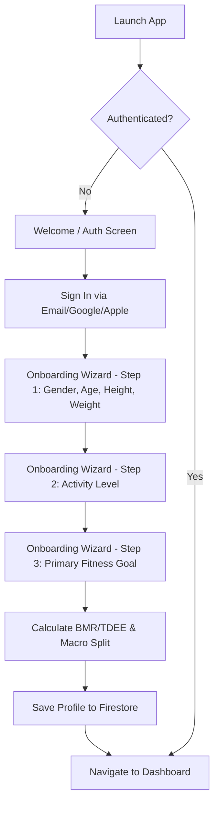
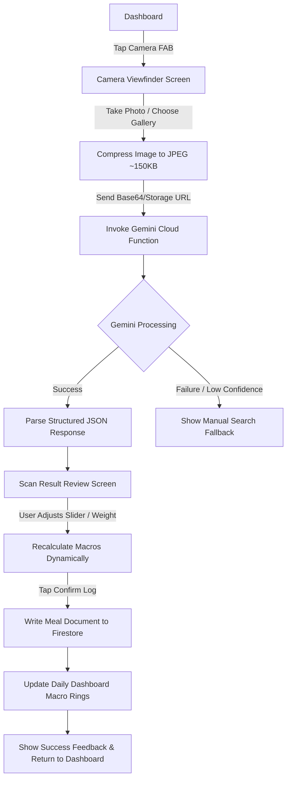
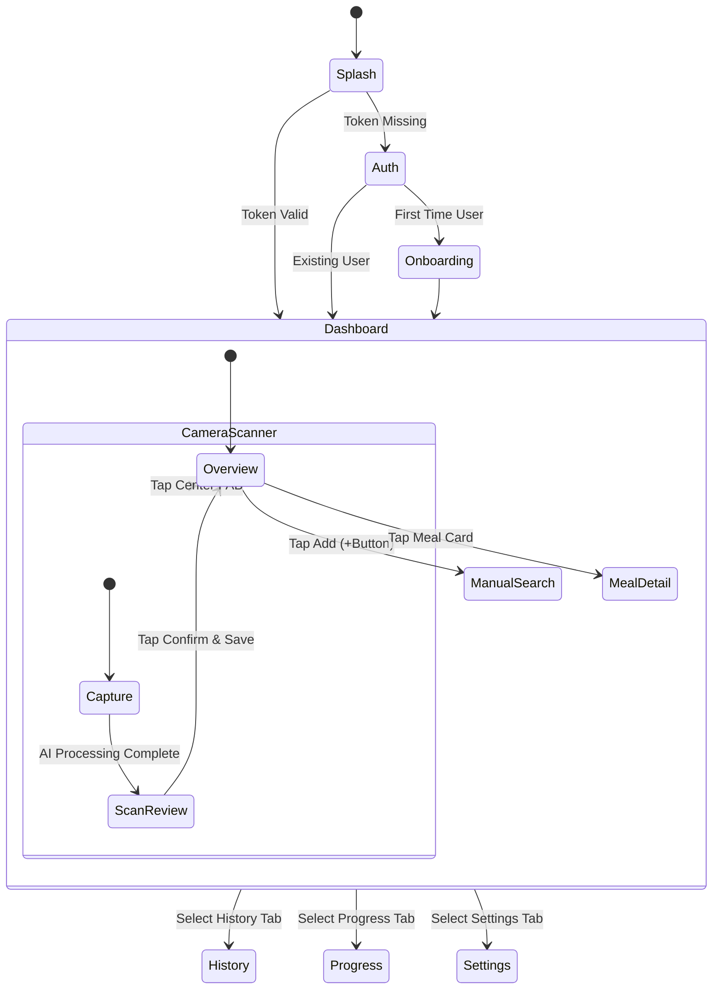
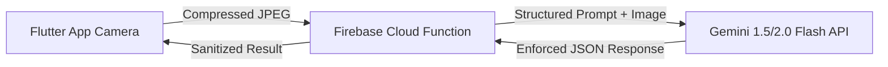
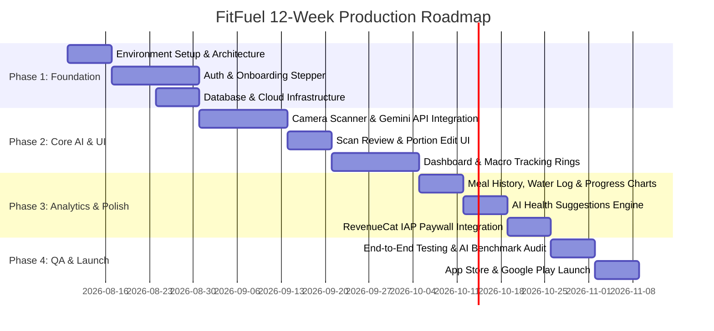

# FitFuel — Comprehensive Software Planning Document
**AI-Powered Nutrition, Calorie Tracking & Healthy Eating Assistant**

---

| Document Version | Date | Target Platform | Lead Architect & Author |
| :--- | :--- | :--- | :--- |
| 1.0.0-PROD | August 2026 | Flutter (iOS & Android) | Senior Software Architect & Technical Lead |

---

## Executive Summary

**FitFuel** is a next-generation mobile application built using Flutter and powered by Google Gemini Vision AI. Designed to eliminate the primary friction point of traditional calorie counters—manual database searching and weigh-scale logging—FitFuel enables users to log meals in under 5 seconds by simply taking a photograph. 

This document outlines the complete architectural blueprint, user experience design, database schemas, AI integration strategies, security policies, and monetization roadmaps required to deliver a production-ready MVP and scale it to a global user base.

---

## Table of Contents
1. [Project Overview](#1-project-overview)
2. [Vision & Mission](#2-vision--mission)
3. [Problem Statement](#3-problem-statement)
4. [Business Goals](#4-business-goals)
5. [Target Audience](#5-target-audience)
6. [User Personas](#6-user-personas)
7. [User Stories](#7-user-stories)
8. [Functional Requirements](#8-functional-requirements)
9. [Non-Functional Requirements](#9-non-functional-requirements)
10. [MVP Scope](#10-mvp-scope)
11. [Future Scope](#11-future-scope)
12. [Feature Prioritization](#12-feature-prioritization)
13. [Competitor Analysis](#13-competitor-analysis)
14. [User Flow](#14-user-flow)
15. [Information Architecture](#15-information-architecture)
16. [Complete Screen List](#16-complete-screen-list)
17. [Navigation Flow](#17-navigation-flow)
18. [Firebase Database Design](#18-firebase-database-design)
19. [Storage Structure](#19-storage-structure)
20. [API Planning](#20-api-planning)
21. [Gemini AI Integration Strategy](#21-gemini-ai-integration-strategy)
22. [Nutrition Data Strategy](#22-nutrition-data-strategy)
23. [Security Plan](#23-security-plan)
24. [Privacy Policy Requirements](#24-privacy-policy-requirements)
25. [Monetization Strategy](#25-monetization-strategy)
26. [Subscription Model](#26-subscription-model)
27. [Analytics Plan](#27-analytics-plan)
28. [Testing Strategy](#28-testing-strategy)
29. [Risk Analysis](#29-risk-analysis)
30. [Development Roadmap](#30-development-roadmap)

---

## 1. Project Overview

FitFuel is a cross-platform mobile application engineered with Flutter for client applications (iOS and Android) and backed by a serverless Google Cloud / Firebase ecosystem. At its core, FitFuel utilizes the **Gemini 1.5/2.0 Flash Multimodal API** to perform instant visual food identification, volume/portion estimation, and macro-nutritional calculations directly from camera snapshots.

### Core System Stack
* **Client Frontend:** Flutter (Dart) — Single codebase targeting iOS 15+ and Android 8.0 (API 26+)
* **State Management:** BLoC (Business Logic Component) / Riverpod architecture for strict reactive state separation
* **Backend Infrastructure:** Firebase Serverless (Authentication, Cloud Firestore, Cloud Storage, Cloud Functions Node.js/TypeScript runtime)
* **AI Engine:** Google Gemini Vision Multimodal API via GCP Vertex AI / Firebase Extensions
* **Enrichment DB:** USDA FoodData Central API & Open Food Facts API (Fallback verification layer)

---

## 2. Vision & Mission

### Vision
To revolutionize nutritional mindfulness by making health tracking completely effortless, accurate, and accessible to anyone with a smartphone.

### Mission
To build an intelligent, friction-free AI assistant that transforms raw visual food inputs into precise, actionable nutritional insights within seconds, helping users form sustainable healthy habits without the burden of manual logging.

---

## 3. Problem Statement

Traditional health and calorie-tracking mobile applications (e.g., MyFitnessPal, Lose It!) suffer from severe retention drop-off due to **high interaction friction**:

1. **Search Fatigue:** Searching text databases yields hundreds of ambiguous options (e.g., "Grilled Chicken Breast" returns 250 conflicting entries).
2. **Portion Misestimation:** Unassisted users misjudge portion sizes by 30% to 60%, corrupting calorie tracking accuracy.
3. **Time Burden:** Logging a single complex meal takes 2–3 minutes, adding up to 10+ minutes per day.
4. **Lack of Contextual Coaching:** Legacy apps display passive numbers without delivering real-time, personalized dietary guidance.

FitFuel resolves all four challenges by turning a 2-minute text search task into a **3-second point-and-shoot camera capture**.

---

## 4. Business Goals

* **User Acquisition:** Reach 100,000 Monthly Active Users (MAU) within 6 months post-launch.
* **Engagement & Retention:** Achieve a Day-30 user retention rate of >35% (more than double the industry benchmark of ~15%).
* **Logging Efficiency:** Maintain an average end-to-end meal logging duration under 5 seconds.
* **Monetization:** Conversion rate of 6% to 8% from Free to FitFuel Pro subscription tier within 90 days of onboarding.
* **AI Precision:** Deliver >90% accuracy on multi-item meal detection and macronutrient estimation across top global cuisines.

---

## 5. Target Audience

1. **Time-Constrained Professionals (Ages 25–45):** High income, busy schedules, desire to maintain fitness without spending time typing meal entries.
2. **Fitness Enthusiasts & Athletes (Ages 18–35):** Track strict macronutrient ratios (Protein, Carbs, Fat) for muscle gain, cutting, or performance optimization.
3. **Weight Management Seekers (Ages 20–60):** Individuals pursuing fat loss or healthy weight maintenance through caloric deficit tracking.
4. **Health-Conscious Beginners:** Users intimidated by traditional complex calorie trackers who want a modern, intuitive, visual health companion.

---

## 6. User Personas

### Persona A: "Busy Alex" (32, Tech Product Manager)
* **Goal:** Lose 5 kg while working 50+ hours a week.
* **Pain Point:** Quits calorie tracking apps after 3 days because typing every ingredient during lunch meetings is awkward and tedious.
* **FitFuel Solution:** Snaps a photo of his restaurant salad or meal prep box in 2 seconds and resumes working.

### Persona B: "Fitness Sarah" (26, Crossfit Athlete)
* **Goal:** Consume exactly 150g protein and stay within 2,200 kcal daily budget.
* **Pain Point:** Needs granular macro breakdowns; wants to quickly tweak portion sizes if the AI estimation is off by 20g.
* **FitFuel Solution:** Uses the intuitive macro ring visualizer and portion sliders to fine-tune meal logs instantaneously.

### Persona C: "Health-Minded David" (50, Executive Managing Hypertension)
* **Goal:** Reduce sodium intake and improve general diet quality.
* **Pain Point:** Confused by complex nutrition labels and doesn't know what foods are triggering poor health outcomes.
* **FitFuel Solution:** Receives friendly AI Health Suggestions pointing out high-sodium or heavily processed foods in his daily log.

---

## 7. User Stories

| Story ID | As a... | I want to... | So that I can... | Acceptance Criteria |
| :--- | :--- | :--- | :--- | :--- |
| **US-01** | New User | Sign up with Google/Apple/Email and complete my bio setup | Get personalized daily calorie and macro goals | Profile wizard calculates TDEE & macro targets based on Mifflin-St Jeor formula. |
| **US-02** | Active User | Snap a picture of my food plate using the camera | Automatically detect items and macros without typing | Camera screen captures image, sends to Gemini, and displays detected items < 3s. |
| **US-03** | Active User | Adjust the detected food portions with a slider | Correct any AI estimation errors easily | User can edit item weights; macros update dynamically in real time. |
| **US-04** | Active User | Log water consumption in 250ml / 500ml quick increments | Track daily hydration alongside food intake | Tap button adds water to daily progress bar and persists in database. |
| **US-05** | Active User | View my Dashboard progress rings | See remaining calories, protein, carbs, and fat at a glance | Rings update reactively upon adding a meal or water entry. |
| **US-06** | Active User | View my past meal logs in a calendar format | Review past eating habits and track trends | Calendar allows picking any past date to view full logged meal breakdown. |
| **US-07** | Active User | Receive AI Health Suggestions based on my daily log | Make healthier meal choices for the rest of the day | AI analyzes daily log and generates 2-3 tailored health insights. |

---

## 8. Functional Requirements

### 8.1 Authentication & Onboarding
* **FR-1.1:** Social Auth integration (Google Sign-In, Apple ID) and Email/Password with email verification.
* **FR-1.2:** Step-by-step Onboarding Stepper capturing Age, Height (cm/ft-in), Weight (kg/lbs), Gender, Activity Level (Sedentary, Lightly Active, Moderately Active, Very Active), and Primary Goal (Lose Weight, Maintain, Gain Muscle).
* **FR-1.3:** Automated Basal Metabolic Rate (BMR) and Total Daily Energy Expenditure (TDEE) calculation engine using the Mifflin-St Jeor formula.

### 8.2 Dashboard & Daily Tracking
* **FR-2.1:** Real-time visual progress indicators for Calories (Consumed vs Goal), Protein, Carbohydrates, and Fats.
* **FR-2.2:** Hydration log widget supporting quick additions (+250ml, +500ml, custom amount) with daily progress bar.
* **FR-2.3:** Daily meal timeline grouped into Breakfast, Lunch, Dinner, and Snacks with macro badges per item.

### 8.3 AI Camera Scanner & Recognition
* **FR-3.1:** Integrated camera viewfinder with auto-focus, flash toggle, grid overlay, and gallery image picker.
* **FR-3.2:** Sub-3-second image compression and secure payload transmission to Gemini AI endpoint.
* **FR-3.3:** Structured multi-item recognition returning item names, estimated weight in grams, confidence score, and nutritional breakdown.
* **FR-3.4:** Interactive Scan Review Screen featuring portion modification sliders, item addition/deletion, and manual search overrides.

### 8.4 Analytics, History & Insights
* **FR-4.1:** Interactive calendar view displaying historical log completion status, total calories, and macro breakdown per date.
* **FR-4.2:** AI Health Nudges module producing contextual daily advice based on logged macro deficits, sodium levels, and balance.
* **FR-4.3:** Progress charts visualizing weight changes and daily calorie adherence over 7-day, 30-day, and 90-day intervals.

---

## 9. Non-Functional Requirements

### 9.1 Performance
* **NFR-1.1 Application Launch:** Cold boot time under 1.5 seconds on mid-tier hardware.
* **NFR-1.2 Frame Rate:** Smooth 60 fps / 120 fps rendering across Flutter UI screens without dropped frames during animations.
* **NFR-1.3 Latency:** End-to-end food recognition pipeline execution under 3.0 seconds on standard 4G/5G mobile connections.

### 9.2 Scalability & Availability
* **NFR-2.1 Serverless Architecture:** Auto-scaling backend handling 10,000 concurrent AI scan requests without manual infrastructure provisioning.
* **NFR-2.2 Availability:** 99.9% uptime SLA for Firebase Cloud Functions and Firestore data services.

### 9.3 Security & Compliance
* **NFR-3.1 Data Encryption:** TLS 1.3 enforced for all network transit; AES-256 encryption at rest for database and cloud storage.
* **NFR-3.2 Authentication Security:** OAuth 2.0 / JWT-based stateless authorization with refresh token rotation.
* **NFR-3.3 Privacy:** Compliance with GDPR, CCPA, and Apple App Store Health & Biometric Data Privacy guidelines.

### 9.4 Usability & Accessibility
* **NFR-4.1 Accessibility:** WCAG 2.1 Level AA compliance, including screen reader support (Semantics in Flutter), minimum touch targets of 48x48 dp, and high-contrast color ratios.
* **NFR-4.2 Internationalization (i18n):** RTL and multi-language support architecture (English, Spanish, French, German, Japanese for Phase 1).

---

## 10. MVP Scope

The Minimum Viable Product (MVP) focuses strictly on delivering the frictionless AI visual food logging experience:

* User Registration & Authentication (Email, Google, Apple)
* User Profile Setup & TDEE Goal Calculation Engine
* Main Dashboard with Dynamic Macro & Calorie Tracking Rings
* AI Food Scanner using Camera & Gallery Uploads
* Gemini Vision AI Multimodal Recognition & Nutrition Parsing Engine
* Scan Review & Interactive Portion Editing Screen
* Quick Water Intake Tracker
* Daily Meal Timeline & History Log (Last 30 days)
* Basic Progress Tracking (Weight & Calorie Adherence Charts)
* Rule-Based & AI-Driven Health Suggestions Engine
* User Profile Settings & Measurement Unit Preference Toggles

---

## 11. Future Scope

Post-MVP expansions will transform FitFuel into a complete 360-degree health platform:

* **Barcode Scanner Engine:** Native camera barcode reading using Google ML Kit connected to Open Food Facts database.
* **AI Meal Planner:** Custom weekly meal generation tailored to macro goals, dietary restrictions, and budget.
* **Smart Grocery List:** Automated shopping list generation aggregated from weekly meal plans.
* **Restaurant Menu Analysis:** Geolocation-aware analysis of local menu items with macro estimates.
* **AI Diet Coach (Chat):** Conversational AI assistant for real-time dietary advice and Q&A.
* **Smart Push Notifications:** Contextual reminders for logging meals, drinking water, and achieving goals.
* **Wearable Device Integration:** HealthKit (iOS) and Health Connect / Google Fit (Android) sync for burned calories and steps.
* **FitFuel Pro Subscription:** In-app purchase integration for unlimited AI scans and advanced micronutrient analytics.
* **Family Accounts & Social Feed:** Shared meal planning, recipes, and accountability challenges.

---

## 12. Feature Prioritization

Features are categorized using the **MoSCoW Framework**:

```
+-----------------------------------------------------------------------+
|                              MUST HAVE                                |
|  - User Auth & Profile Setup      - AI Camera Food Scanner (Gemini)   |
|  - TDEE & Macro Goal Calculator   - Scan Result Review & Edit Screen  |
|  - Main Dashboard (Macro Rings)   - Water Tracker & Daily Meal History|
+-----------------------------------------------------------------------+
|                             SHOULD HAVE                               |
|  - AI Health Suggestions Engine   - Weight Progress Trend Charts      |
|  - Offline Logging Caching        - Social Sign-in (Google/Apple)     |
+-----------------------------------------------------------------------+
|                             COULD HAVE                                |
|  - Dark Mode / Light Mode Theme   - Export Logs to PDF/CSV            |
|  - Custom Water Goal Reminders    - Recipe Custom Creation Tool       |
+-----------------------------------------------------------------------+
|                             WON'T HAVE (MVP)                          |
|  - Barcode Scanner Integration    - Wearable Smartwatch Sync          |
|  - AI Diet Coach Chatbot          - Subscription Paywall Enforcement  |
+-----------------------------------------------------------------------+
```

---

## 13. Competitor Analysis

| Feature / Metric | FitFuel (Target) | MyFitnessPal | Lose It! | Cal AI | Yuka |
| :--- | :--- | :--- | :--- | :--- | :--- |
| **Primary Input Method** | Instant Camera AI | Manual Search | Search / Barcode | Camera AI | Barcode Only |
| **Logging Latency** | **< 3 seconds** | 60–120 seconds | 30–60 seconds | 3–5 seconds | N/A (Scan only) |
| **Multi-Item Plate Recognition** | **Native (Gemini Multimodal)** | Poor / Manual | Limited | Fair | None |
| **Portion Adjustability UI** | Dynamic Slider | Manual Typing | Dropdown List | Slider | N/A |
| **AI Contextual Health Coach** | Built-in | None | None | Basic | Product score only |
| **Pricing Model** | Freemium ($9.99/mo) | Freemium ($19.99/mo) | Freemium ($39.99/yr) | Paid ($14.99/mo) | Free / $10/yr |

---

## 14. User Flow

### 14.1 User Onboarding & Goal Setup Flow



### 14.2 AI Food Scanner & Logging Flow



---

## 15. Information Architecture

```
FitFuel Application Root
├── 1. Auth & Onboarding Module
│   ├── Welcome Landing Screen
│   ├── Login / Registration Modal
│   ├── Password Reset Screen
│   └── Onboarding Stepper (Bio Data, Activity Level, Goals, TDEE Summary)
├── 2. Core Dashboard Module
│   ├── Calorie Summary Ring Card
│   ├── Macronutrient Progress Bar (Protein, Carbs, Fat)
│   ├── Quick Water Tracker Widget
│   ├── Daily Meal Timeline List (Breakfast, Lunch, Dinner, Snacks)
│   └── AI Health Suggestion Card
├── 3. AI Camera & Logging Module
│   ├── Camera Viewfinder Screen (Flash, Grid, Flip, Gallery Picker)
│   ├── Scanning Loading Overlay
│   ├── Scan Review & Portion Adjustment Screen
│   └── Manual Food Search & Custom Food Creator
├── 4. History & Progress Module
│   ├── Calendar Date Selector Screen
│   ├── Historical Meal Log Detail View
│   └── Weight & Macro Trend Charts (7d / 30d / 90d)
└── 5. Settings & Profile Module
    ├── Profile Editor (Weight update, TDEE recalculation)
    ├── Measurement Units (Metric / Imperial)
    ├── Dietary Preferences (Keto, Vegan, Balanced)
    ├── Subscription & Billing Management
    └── Privacy & Account Security
```

---

## 16. Complete Screen List

| Screen ID | Screen Name | Key UI Elements / Components | Primary Function |
| :--- | :--- | :--- | :--- |
| **SCR-01** | Splash Screen | Animated FitFuel Logo, Initialization Loader | App setup, auth token check, routing |
| **SCR-02** | Auth Screen | Tab View (Sign In / Register), OAuth Buttons | User login and social sign-in |
| **SCR-03** | Onboarding Wizard | 4-step Horizontal PageView, Input Pickers, Next Button | Collect user bio metrics & compute TDEE |
| **SCR-04** | Main Dashboard | Calorie Meter, Macro Bars, Water Widget, Meal Timeline, FAB | Primary hub for daily health tracking |
| **SCR-05** | Camera Scanner | Viewfinder, Shutter Button, Flash Toggle, Gallery Button | Capture food photo for AI analysis |
| **SCR-06** | Scan Processing | Lottie Loading Animation, AI Status Messages | Background processing feedback |
| **SCR-07** | Scan Review & Edit | Food Item Cards, Grams Slider, Macro Breakdown, Confirm Button | Edit AI estimation before saving |
| **SCR-08** | Manual Food Search | Search Bar, Recent Items, Custom Item Creator | Fallback manual text search |
| **SCR-09** | Meal History | Calendar Bar, Daily Meal Cards, Macro Summary | Review historical meal logs |
| **SCR-10** | Progress & Analytics | Line Charts (Weight/Calories), Macro Distribution Pie Chart | Long-term trend analysis |
| **SCR-11** | AI Health Insights | Insight Feed Cards, Filter Toggles (Nutrition/Habits) | Personal health advice stream |
| **SCR-12** | Profile & Settings | User Avatar, Goal Modifiers, Unit Toggle, Account Action | Manage account settings |

---

## 17. Navigation Flow

FitFuel utilizes a **Bottom Navigation Bar** hierarchy combined with a persistent Floating Action Button (FAB) for the Camera Scanner:

```
[Bottom Nav: Tab 1] -> Dashboard Screen (SCR-04)
[Bottom Nav: Tab 2] -> History Screen (SCR-09)
[Center FAB Button] -> Camera Scanner Screen (SCR-05) [Modal Sheet Push]
[Bottom Nav: Tab 3] -> Progress Screen (SCR-10)
[Bottom Nav: Tab 4] -> Settings Screen (SCR-12)
```



---

## 18. Firebase Database Design

Cloud Firestore is structured in a **User-Centric Document Model** to ensure strict authorization boundaries, minimal query latency, and high scalability.

### 18.1 Collection Architecture

```
firestore-root
├── users (Collection)
│   └── {userId} (Document)
│       ├── goals (Subcollection)
│       │   └── currentGoal (Document)
│       ├── dailyLogs (Subcollection)
│       │   └── {YYYY-MM-DD} (Document)
│       │       ├── meals (Subcollection)
│       │       │   └── {mealId} (Document)
│       │       └── waterLogs (Subcollection)
│       │           └── {waterLogId} (Document)
│       └── weightLogs (Subcollection)
│           └── {logId} (Document)
└── globalFoodCatalog (Collection)
    └── {foodId} (Document)
```

### 18.2 Document Schemas

#### Collection: `users/{userId}`
```json
{
  "uid": "usr_98f7a6b5c4",
  "email": "alex.dev@example.com",
  "displayName": "Alex Turner",
  "photoUrl": "https://lh3.googleusercontent.com/a/default-user",
  "createdAt": "2026-08-01T10:00:00Z",
  "lastLoginAt": "2026-08-06T18:30:00Z",
  "profile": {
    "gender": "male",
    "age": 32,
    "heightCm": 180,
    "currentWeightKg": 82.5,
    "targetWeightKg": 78.0,
    "activityLevel": "moderately_active",
    "primaryGoal": "lose_weight",
    "unitSystem": "metric"
  }
}
```

#### Collection: `users/{userId}/goals/currentGoal`
```json
{
  "bmr": 1825,
  "tdee": 2510,
  "dailyCalorieTarget": 2010,
  "macroTargets": {
    "proteinGrams": 150,
    "carbsGrams": 200,
    "fatGrams": 67
  },
  "waterTargetMl": 3000,
  "updatedAt": "2026-08-01T10:15:00Z"
}
```

#### Collection: `users/{userId}/dailyLogs/{YYYY-MM-DD}`
```json
{
  "date": "2026-08-06",
  "totalCalories": 1850,
  "totalProteinGrams": 142.5,
  "totalCarbsGrams": 180.0,
  "totalFatGrams": 61.0,
  "totalWaterMl": 2500,
  "isTargetMet": true,
  "lastUpdated": "2026-08-06T19:15:00Z"
}
```

#### Collection: `users/{userId}/dailyLogs/{YYYY-MM-DD}/meals/{mealId}`
```json
{
  "mealId": "meal_38a91c",
  "mealType": "lunch",
  "loggedAt": "2026-08-06T13:15:00Z",
  "source": "gemini_vision",
  "imageUrl": "https://firebasestorage.googleapis.com/v0/b/fitfuel.appspot.com/o/users%2Fusr_98f7a6b5c4%2Fscans%2F2026-08%2Fscan_12345.jpg",
  "confidenceScore": 0.94,
  "summary": {
    "totalCalories": 650,
    "proteinGrams": 45.0,
    "carbsGrams": 55.0,
    "fatGrams": 22.0
  },
  "items": [
    {
      "itemId": "item_1",
      "name": "Grilled Chicken Breast",
      "servingWeightGrams": 200,
      "calories": 330,
      "proteinGrams": 62.0,
      "carbsGrams": 0.0,
      "fatGrams": 7.2
    },
    {
      "itemId": "item_2",
      "name": "Steamed White Rice",
      "servingWeightGrams": 150,
      "calories": 195,
      "proteinGrams": 4.0,
      "carbsGrams": 43.0,
      "fatGrams": 0.4
    }
  ]
}
```

---

## 19. Storage Structure

Firebase Storage is organized to isolate user media securely and automatically apply lifecycle retention rules:

```
gs://fitfuel-app.appspot.com/
├── users/
│   └── {userId}/
│       ├── profile/
│       │   └── avatar.jpg
│       └── scans/
│           └── {YYYY-MM}/
│               └── scan_{scanId}.jpg
```

### Compression & Pipeline Requirements
* **Client-Side Pre-processing:** Images captured via Flutter camera plugin are downscaled on-device to a maximum resolution of **1024 x 1024 pixels** at **80% JPEG quality** (producing an average file size of ~120KB–180KB).
* **Storage Lifecycle Rule:** Raw scan images in `/scans/` are set to auto-expire and purge after **60 days** unless marked as a "Saved Recipe" by the user, minimizing cloud storage overhead.

---

## 20. API Planning

All client communication with AI engines and database services passes through secure **Firebase Cloud Functions (HTTPS Callable & REST APIs)**.

### Endpoint Specifications

#### 1. `POST /api/v1/scanFood`
* **Description:** Receives a base64 encoded food image or storage URL, invokes Gemini 1.5/2.0 Flash, and returns structured nutritional estimations.
* **Headers:** `Authorization: Bearer <Firebase_ID_Token>`
* **Request Payload:**
```json
{
  "imageBase64": "data:image/jpeg;base64,/9j/4AAQSkZJRg...",
  "locale": "en-US",
  "mealTypeHint": "lunch"
}
```
* **Response Payload (200 OK):**
```json
{
  "success": true,
  "scanId": "scan_88f91a2b",
  "confidenceScore": 0.92,
  "detectedItems": [
    {
      "name": "Salmon Fillet",
      "estimatedGrams": 180,
      "calories": 370,
      "macros": {
        "proteinGrams": 36.0,
        "carbsGrams": 0.0,
        "fatGrams": 23.0
      }
    },
    {
      "name": "Roasted Asparagus",
      "estimatedGrams": 100,
      "calories": 40,
      "macros": {
        "proteinGrams": 4.0,
        "carbsGrams": 7.0,
        "fatGrams": 0.5
      }
    }
  ],
  "totalMeal": {
    "calories": 410,
    "proteinGrams": 40.0,
    "carbsGrams": 7.0,
    "fatGrams": 23.5
  }
}
```

#### 2. `POST /api/v1/generateHealthInsight`
* **Description:** Evaluates the user's daily log against their personal goal targets and generates actionable AI suggestions.
* **Request Payload:** `{"date": "2026-08-06"}`
* **Response Payload (200 OK):**
```json
{
  "date": "2026-08-06",
  "insights": [
    {
      "type": "warning",
      "title": "High Sodium Indicator",
      "message": "Your lunch provided 65% of your recommended daily sodium. Consider a low-sodium dinner like fresh grilled vegetables."
    },
    {
      "type": "positive",
      "title": "Great Protein Pacing!",
      "message": "You've already hit 85% of your daily protein target. Excellent work supporting muscle recovery!"
    }
  ]
}
```

---

## 21. Gemini AI Integration Strategy

FitFuel leverages **Google Gemini 1.5 Flash / 2.0 Flash** due to its low visual inference latency (sub-1.5s), cost efficiency, and native support for **Structured JSON Outputs (`response_schema`)**.



### System Prompt Engineering
The system prompt passed to Gemini is strictly configured with zero temperature variance to enforce precision and eliminate hallucinations:

```text
You are a expert clinical nutritionist and computer vision system.
Analyze the provided meal image and identify all distinct food items present.
For each detected item:
1. Estimate the serving weight in grams based on visual volume cues, standard plate proportions, and contextual scale.
2. Calculate total energy (kcal), Protein (g), Carbohydrates (g), and Total Fat (g) for the estimated portion weight.
3. Return a confidence score between 0.00 and 1.00 for the detection accuracy.

Output MUST strictly conform to the JSON schema provided. Do NOT output conversational text, markdown wrapping, or explanations.
```

### Fallback & Robustness Mechanisms
1. **Low Confidence Handling (< 0.70):** If Gemini flags low certainty (e.g., heavily mixed stews or ambiguous sauces), the mobile client presents an interactive alert asking the user to confirm or perform a quick text search.
2. **USDA API Cross-Check:** High-calorie items detected by Gemini are asynchronously checked against the USDA FoodData Central database to ensure nutrient value sanity bounds (e.g., ensuring cooked chicken breast calories do not exceed 200 kcal / 100g).

---

## 22. Nutrition Data Strategy

FitFuel employs a **Hybrid Tri-Layer Validation Model**:

```
Layer 1: Gemini Multimodal AI (Primary Visual Recognition & Weight Estimation)
                   │
                   ▼
Layer 2: USDA FoodData Central & Open Food Facts DB (Nutritional Data Normalization)
                   │
                   ▼
Layer 3: Interactive User Adjustment UI (Portion Gram Slider & Real-time Recalculation)
```

1. **Layer 1 (AI Recognition):** Identifies foods visually and suggests standard gram portions based on plate ratios.
2. **Layer 2 (Database Verification):** Matches recognized food items to verified standard nutritional density values (e.g., verifying macro values per 100g of raw item).
3. **Layer 3 (User Control):** The user retains ultimate authority. If the AI estimates 200g of steak but the user knows it was a 250g cut, dragging the UI slider immediately updates all calorie and macro numbers proportionally.

---

## 23. Security Plan

### 23.1 Authentication & Secret Management
* **Zero Client-Side Secrets:** Gemini API keys, GCP credentials, and third-party secrets are **NEVER stored within the Flutter application binary**. All AI calls pass through authenticated Firebase Cloud Functions.
* **App Check Enforcement:** Firebase App Check with **reCAPTCHA v3 / Play Integrity (Android) & DeviceCheck (iOS)** ensures only legitimate FitFuel app instances can trigger API functions.

### 23.2 Firestore Security Rules
```javascript
rules_version = '2';
service cloud.firestore {
  match /databases/{database}/documents {
    
    // User profile and subcollections: Strict self-access only
    match /users/{userId} {
      allow read, write: if request.auth != null && request.auth.uid == userId;
      
      match /{allSubcollections=**} {
        allow read, write: if request.auth != null && request.auth.uid == userId;
      }
    }
    
    // Global Food Catalog: Read-only for authenticated users
    match /globalFoodCatalog/{foodId} {
      allow read: if request.auth != null;
      allow write: if false; // Server-side admin only
    }
  }
}
```

---

## 24. Privacy Policy Requirements

To pass Apple App Store (App Privacy Details) and Google Play Data Safety reviews, FitFuel implements strict privacy measures:

1. **Camera Permission Transparency:** Explicit runtime prompt stating: *"FitFuel uses your camera solely to take food photos for calorie analysis. Photos are processed securely and are never shared or used for advertisement profiling."*
2. **Data Minimization:** No biometric face scanning or location data is collected or linked to identity.
3. **Right to Erasure (GDPR Art. 17):** In-app "Delete My Account & Data" button permanently deletes the user's Firestore profile, weight history, and all stored scan images within 24 hours.

---

## 25. Monetization Strategy

FitFuel utilizes a **Freemium Subscription Model** engineered to maximize acquisition while converting heavy users into recurring revenue.

### Free Tier vs. FitFuel Pro Matrix

| Feature | Free Tier | FitFuel Pro |
| :--- | :--- | :--- |
| **AI Camera Scans** | 5 scans per day | **Unlimited Scans** |
| **Basic Macro Tracking (Protein, Carbs, Fat)** | Included | Included |
| **Water Tracker** | Included | Included |
| **Meal History** | 7 Days | **Unlimited Lifetime History** |
| **AI Health Suggestions** | Basic Daily Overview | **Deep Micronutrient Analytics & Recommendations** |
| **Barcode Scanner (Future)** | Limited (10/mo) | **Unlimited** |
| **Data Export (CSV / HealthKit)** | Excluded | **Included** |

---

## 26. Subscription Model

Powered by **RevenueCat** for cross-platform In-App Purchase (IAP) management:

```
FitFuel Pro Tiers:
├── Monthly Plan: $9.99 / month (7-day free trial)
├── Annual Plan:  $59.99 / year ($4.99/mo equivalent — 50% discount badge)
└── Lifetime Plan: $149.99 one-time payment
```

### Conversion Triggers
* **Soft Paywall:** Triggered when a free user reaches their 5th camera scan in a single day.
* **Value Paywall:** Promoted on the Progress Screen when trying to view history beyond 7 days or export data.

---

## 27. Analytics Plan

Implemented using **Firebase Analytics & Mixpanel** to measure activation, engagement, and conversion funnels:

### Core Event Taxonomy
* `auth_signup_completed`: `{ method: 'google' | 'apple' | 'email' }`
* `onboarding_completed`: `{ goal: 'lose_weight', tdee: 2200 }`
* `scan_initiated`: `{ source: 'camera' | 'gallery' }`
* `scan_completed`: `{ latency_ms: 1850, confidence: 0.94, item_count: 3 }`
* `scan_item_edited`: `{ item_name: 'Chicken', original_grams: 150, edited_grams: 200 }`
* `water_logged`: `{ amount_ml: 250 }`
* `paywall_viewed`: `{ trigger_point: 'daily_scan_limit' }`
* `subscription_purchased`: `{ plan_id: 'fitfuel_pro_annual', price: 59.99 }`

---

## 28. Testing Strategy

FitFuel adheres to the **Testing Pyramid Architecture**:

```
        / \
       /   \     Integration Tests (10%) - App Flows & Firebase Emulators
      /     \
     /-------\   Widget Tests (30%) - Flutter UI Components & State
    /---------\
   /-----------\ Unit Tests (60%) - TDEE Engine, Macro Calculators, Repositories
```

### 28.1 Automated Test Suites
1. **Unit Testing:** 100% code coverage on TDEE mathematical engines, macro aggregators, BLoC state transitions, and JSON serialization logic.
2. **Widget Testing:** UI layout verification for custom sliders, macro progress rings, and form inputs.
3. **Integration Testing:** End-to-end user onboarding flow tested using Flutter Driver against local Firebase Emulators.

### 28.2 AI Recognition Accuracy Harness
A specialized test harness consisting of **200 benchmark food images** with known ground-truth weights and macros is executed automatically before production deployments. The release is gated on achieving:
* **Item Recognition Precision:** $\ge 92\%$
* **Calorie Estimation Mean Absolute Percentage Error (MAPE):** $\le 12\%$

---

## 29. Risk Analysis

| Risk ID | Risk Description | Prob. | Impact | Mitigation Strategy |
| :--- | :--- | :--- | :--- | :--- |
| **RSK-01** | Gemini API latency spikes during peak meal hours (e.g. 12 PM - 1 PM) | Medium | High | Implement client-side loading feedback, aggressive Cloud Function timeout settings (5s), and regional function deployment near Gemini endpoints. |
| **RSK-02** | User misinterprets AI estimation as medical/dietary prescription | Low | High | Clear disclaimers on onboarding and scan screens: *"FitFuel estimates are for informational health tracking only. Consult a doctor for medical advice."* |
| **RSK-03** | Cloud API usage cost overrun due to viral user growth | Medium | Medium | Enforce strict per-user rate limits (5 scans/day for free users) and cache common food scan image hashes in Redis / Firestore. |
| **RSK-04** | User denies camera access permissions | High | Medium | Graceful UI fallback prompting gallery photo selection or manual text food search. |

---

## 30. Development Roadmap

The project is structured into a **12-Week Agile Development Plan**:



---
*End of Software Planning Document.*
